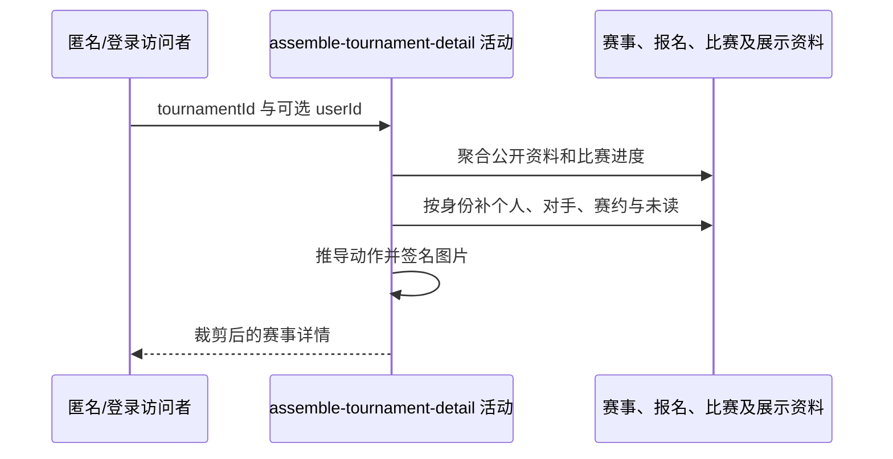

## 概要

聚合赛事公开信息、个人进度、当前动作与关联活动卡片。

## 时序图

## 触发条件

匿名或登录用户打开指定赛事详情时执行；记录访问后会再次补全个人区块。

## 活动契约

### 入参

| 字段 | 类型 | 必填 | 约束 |
|---|---|---|---|
| `tournamentId` | 字符串 | 是 | 必须命中现有赛事 |
| `userId` | 字符串 | 否 | 为空按匿名裁剪；非空时补个人进度与动作 |

### 成功返回

| 字段 | 类型 | 必填 | 说明 |
|---|---|---|---|
| `tournament` | 赛事详情 | 是 | 公开配置、展示状态、进度、签表、参赛者、冠军及拒赛统计；`championUsers` 从冠军参赛编号对应报名中取用户与搭档编号，依报名顺序按 `userId` 去重，每人交付 `userId`、`name`、`avatarUrl` 和 `gender`，未产生冠军时为空列表；进度中可晋级名额表示本轮胜出席位总数，资格赛的已晋级名额按已支付锁位的参赛编号去重统计，正赛含决赛按当前轮次已完成比赛数统计 |
| `userProgress` | 个人进度 | 否 | 登录且已报名时包含时间线、当前比赛、对手、赛约与未读 |
| `currentAction` | 枚举 | 是 | 按匿名、报名、比赛、轮次及终态推导 |
| `imageUrls` | 签名地址集合 | 否 | 赛事图片和用户头像有效 3600 秒 |

## 异常分支

| 错误标识 | 触发条件 | 来源 |
|---|---|---|
| `TOURNAMENT_NOT_FOUND` | 赛事不存在 | get-tournament-detail 流程同名错误一行 |
| 降级 | 未登录/未报名、当前比赛或资料缺失、对手无法唯一定位 | get-tournament-detail 流程降级一行 |
| 登录凭证无效 | 限制判断所需本人资料不存在 | get-tournament-detail 流程登录凭证无效一行 |
| `MEETUP_NOT_FOUND` | 已记录的关联活动不存在 | get-tournament-detail 流程同名错误一行 |
| `OPERATION_FAILED` | 转换、图片签名或依赖读取失败 | get-tournament-detail 流程同名错误一行 |

## 领域依赖

无

## 业务动作

- A1 聚合赛事、冠军成员身份与整体进度，统计当前轮次的可晋级与已晋级名额。
- A2 按身份裁剪个人区块。
- A3 补当前比赛和对手信息。
- A4 推导当前动作与活动卡片。
- A5 补冠军与其他参赛用户资料并签名图片。

## 详细流程

1. A1 读取赛事、全部报名、比赛和参与关系，组装公开资料、展示状态、进度、签表、参赛者和拒赛统计。冠军参赛编号为空时交付空 `championUsers`；否则从该参赛编号的报名记录中依次收集用户编号与搭档编号，保留首次出现顺序并按用户编号去重。资格赛可晋级名额等于正赛总签位，已晋级名额按已支付并进入正赛的参赛编号去重统计；正赛各轮的可晋级名额等于本轮参赛签位的一半，已晋级名额等于当前轮次已完成比赛数，决赛因此为 1 个可晋级名额且在完赛后为 1 个已晋级名额；调用方用可晋级名额减已晋级名额得到剩余名额。
2. A2 匿名仅返回公开区块和 `NOT_LOGGED_IN`；登录未报名给报名动作及个人限制，不创建报名。
3. A3 已报名者补本人报名、时间线、评论未读；`IN_MATCH` 时取当前未完成/终止比赛，缺失则按等待匹配展示。
4. A3 聚合参与者、确认进度、对手访问时间；只有本人参赛编号可唯一定位且关系允许时交付对手手机号，订场阶段补对手偏好。
5. A4 根据赛事时间、报名轮次、赛事当前轮次、当前比赛和赛约推导动作：`CHAMPION` 优先于赛事 `END`，`WAITING` 报名轮次晚于赛事当前轮次时为 `ADVANCED`，轮次相等时才为 `WAITING_MATCH`；关联赛约/线下活动压缩为卡片。赛约缺失失败，球场缺失则用室外硬地与开始时段背景。
6. A5 批量补冠军与其他参赛用户的昵称、性别、NTRP、头像；冠军成员的昵称映射为 `name`，用户资料缺失时保留 `userId` 且展示字段留空。赛事图与非空头像生成 3600 秒地址，签名失败时整体聚合失败。未读查询不推进已读。

## 边界情况

- 本活动在流程中访问记录前后分段执行，后段失败不会回滚访问时间。
- 对手手机号宁可整体不交付，也不在身份关系含糊时猜测。
- 冠军参赛编号已记录但找不到对应报名时，`championUsers` 降级为空列表，不影响其他赛事详情。
- 冠军用户资料缺失时保留 `userId`，`name`、`avatarUrl` 与 `gender` 留空。
- 正赛已晋级名额只计当前轮次状态为已完成的比赛，已终止及其他状态不计入。
- 详情查询本身不改变赛事、比赛或报名状态。

## 实现提示

纯查询部分按 DB snapshot 声明；签名与卡片组装失败按现有 Java 整体收敛。
