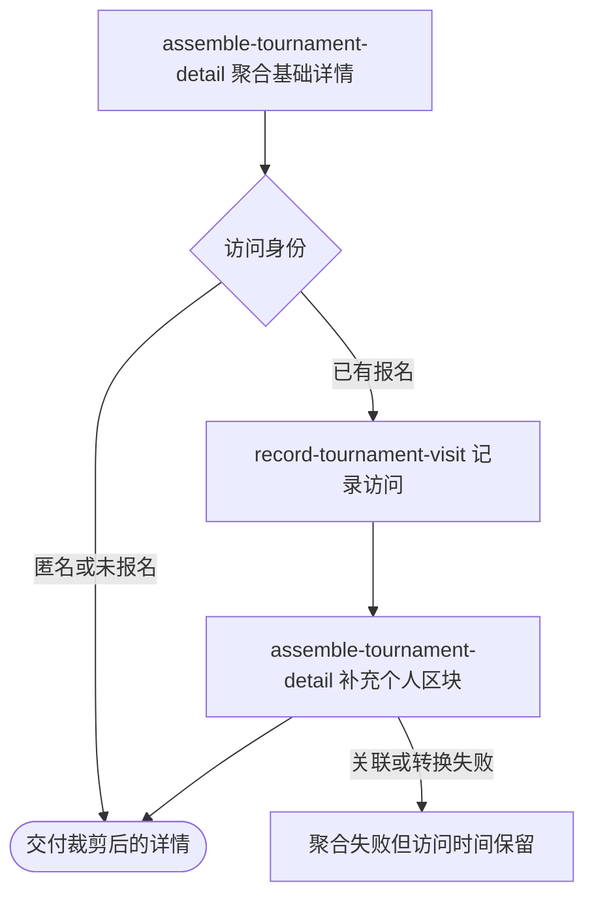

## 概要

向匿名或登录用户聚合交付赛事公开资料、个人进度、当前动作与关联活动。

## 触发

匿名访问者或登录用户打开指定赛事落地页，需要查看公开赛事信息及与本人身份相关的下一步内容。

## 接口契约

路径参数 `bizId` 指定赛事。接口允许匿名访问，成功返回赛事聚合详情；返回内容按登录、报名和当前比赛状态裁剪。赛事图片与用户头像地址限时一小时。

## 业务活动

- assemble-tournament-detail  聚合赛事公开与个人详情
- record-tournament-visit  记录已报名用户最近访问时间

## 流程图

## 详细流程

1. 按赛事编号读取赛事、全部报名、比赛和参与关系，形成公开资料、展示状态、进度、签表、参赛者与拒赛统计。
2. 匿名用户只获得公开区块和未登录动作；已登录未报名用户获得报名动作及适用的个人资料限制。
3. 已报名用户先把本次查询时间写为最近访问时间，再交付本人报名、时间线和评论未读数。
4. 本人在比赛中时取得当前未终止比赛，聚合参与者、确认进度、对手访问时间和符合关系条件的对手手机号；订场阶段补充对手偏好。
5. 根据赛事时间、本人报名、当前比赛和关联赛约推导当前动作；关联赛约或线下活动存在时压缩成交付卡片。
6. 批量补充用户昵称、性别、NTRP 和头像，为赛事及用户图片签发限时地址。
7. 返回赛事详情；评论未读查询不推进阅读位置，详情读取不改变赛事、比赛和报名状态。

## 异常分支

| 对外失败码 | 触发条件 | 由哪个活动报出 | 补偿动作或超时处理 | 对外提示 |
|---|---|---|---|---|
| `TOURNAMENT_NOT_FOUND` | 指定赛事不存在 | assemble-tournament-detail | 不修改任何对象 | 赛事不存在 |
| 未登录 | 请求没有有效登录身份 | assemble-tournament-detail | 交付公开区块与 `NOT_LOGGED_IN` 动作，不记访问 | 查询成功 |
| 未报名 | 登录用户没有该赛事报名 | assemble-tournament-detail | 交付报名动作和适用限制，不建立报名 | 查询成功 |
| 当前比赛缺失 | 报名为 `IN_MATCH`，但没有找到未完成或终止比赛 | assemble-tournament-detail | 不交付当前比赛，动作按等待匹配展示 | 查询成功 |
| 对手关系无法唯一定位 | 本人在比赛中跨多个参赛编号或无法确定本人编号 | assemble-tournament-detail | 不交付任何对手手机号，其他内容继续 | 查询成功 |
| 参赛者资料缺失 | 某参赛用户无用户或网球档案 | assemble-tournament-detail | 相关昵称、头像、性别、NTRP 或手机号留空 | 查询成功 |
| 登录凭证无效 | 未报名或冻结用户用于限制判断的本人资料不存在 | assemble-tournament-detail | 终止聚合；已报名冻结用户的访问时间可能已更新 | 登录凭证无效，请重新登录 |
| `MEETUP_NOT_FOUND` | 当前比赛或线下赛记录的约球不存在 | assemble-tournament-detail | 终止聚合；已写访问时间不回滚 | 约球活动不存在 |
| 球场资料缺失 | 关联约球的球场不存在 | assemble-tournament-detail | 用室外硬地和开始时段形成默认卡片背景 | 查询成功 |
| `OPERATION_FAILED` | 存储内容无法转换、图片地址签发失败或依赖资料读取失败 | assemble-tournament-detail | 终止聚合；已写访问时间可能保留 | 系统异常，请稍后重试 |

## 技术线索

- HTTP：`GET /tournament/detail/{bizId}`，`@OptionalAuth`
- 调用：`TournamentDetailController.detail()` → `TournamentDetailAppService.detail()` → `TournamentDetailService.assembleDetail()`
- 访问记录：`TournamentEntryRepository.updateLastVisitTime()`，发生在应用层后续聚合之前且无统一外层事务
- 依赖：`UserProfileDomainService`、`ChatDomainService`、`MeetupDomainService`、`MeetupCardPackingService`
- 图片：`QiniuConfiguration.buildSignedUrl()`
