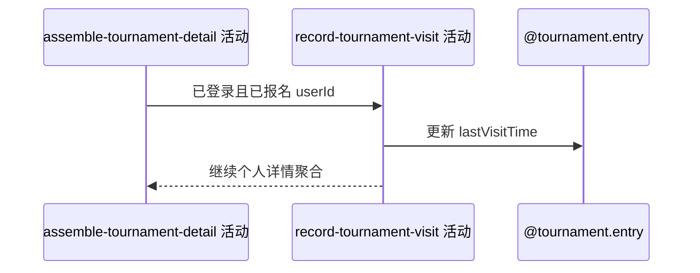

## 概要

记录已报名用户最近一次打开赛事详情的时间。

## 时序图

## 触发条件

详情访问者已登录且存在该赛事报名时执行。

## 活动契约

把本人报名 lastVisitTime 覆盖为本次查询时间；匿名或未报名不写。写入先于后续详情聚合且无统一外层事务。

## 异常分支

| 错误标识 | 触发条件 | 处理 |
|---|---|---|
| 跳过 | 匿名或未报名 | 不写，继续裁剪详情 |
| `OPERATION_FAILED` | 更新时间持久化失败 | 详情请求失败或按未处理异常收敛 |
| 后续失败 | 个人资料、赛约或图片聚合失败 | 已写访问时间保留，不回滚 |

## 领域依赖

### @tournament.entry

- 输入：本人报名与当前查询时间
- 输出：更新后的 lastVisitTime

## 业务动作

A1 识别已报名访问者
A2 覆盖最近访问时间
A3 继续详情聚合

## 详细流程

1. 初步赛事聚合定位当前登录用户的报名；不存在时不执行。
2. 以本次详情查询时刻更新该报名 lastVisitTime。
3. 更新不与后续个人区块、赛约卡片和图片签名共享统一事务。
4. 因而后续详情失败时本次访问仍可能已被对手展示逻辑观察到。

## 边界情况

- 匿名和登录未报名用户不产生访问记录。
- 高频刷新会持续覆盖时间，无节流。
- 访问记录是详情读取的有意副作用。

## 实现提示

写入使用 `@tournament.entry`，`reads` 为空；明确保留非原子边界。
