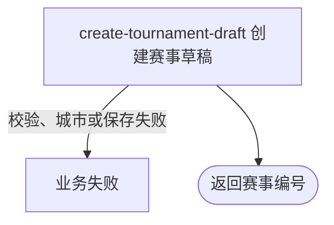

## 概要

由运营建立一项初始为草稿和资格赛轮次的自办赛事。

## 触发

持有后台共享访问密钥的运营调用方要建立一项可继续配置的赛事草稿时发起。

## 接口契约

请求体为完整 `TournamentCreateCmd`，由字段校验与详细流程中的跨字段规则共同约束。成功返回 `TournamentIdDTO`，只含新赛事编号。

## 业务活动

- create-tournament-draft  校验配置、补充城市并初始化赛事草稿

## 流程图

## 详细流程

1. 后台共享 API Key 鉴权通过后，绑定并校验赛事名称、图片键、主题、比赛类型、城市、NTRP、性别、签位、线下轮次、分组人数、费用、奖金、时间、拒赛上限和规则。
2. 业务校验总签位为 2～64 的 2 次方，线下轮次签位数小于总签位；报名费和拒赛上限非负，资格赛组至少 2 人。
3. 校验报名开始早于资格赛开始、各截止不早于对应开始；奖金须为逗号分隔非负整数。枚举文本在转换时必须可识别。
4. 按城市编码查询城市名称；无对应城市会以未处理异常终止，而不是专用业务错误。
5. 生成唯一赛事业务编号，写入全部配置，并初始化 `status=DRAFT`、`currentRound=QUALIFIER`、已锁定正赛席位为 0，结束时间与线下活动编号为空。
6. 创建在一个事务内完成；失败回滚且不交付编号。成功返回赛事编号，不激活报名或创建关联对象。

## 异常分支

| 对外失败码 | 触发条件 | 由哪个活动报出 | 补偿动作或超时处理 | 对外提示 |
|---|---|---|---|---|
| 无权限 | 后台共享 API Key 未配置、缺失或不匹配 | 后台鉴权 | 不进入活动 | 无权限访问 |
| 参数校验错误 | 必填、长度、颜色、最小值、非负或奖金格式不满足命令约束 | 入口校验 | 不创建 | 返回首个无效字段及说明 |
| 业务规则错误 | 签位不是 2 次方、线下轮次过晚，或时间先后不合法 | create-tournament-draft | 不创建 | 对应签位、轮次或时间提示 |
| `OPERATION_FAILED` | 枚举文本无法识别、城市编码无对应城市或其他组装异常 | create-tournament-draft | 创建事务回滚 | 系统异常，请稍后重试 |
| `OPERATION_FAILED` | 持久化失败 | create-tournament-draft | 整个创建事务回滚，不交付编号 | 系统异常，请稍后重试 |

## 技术线索

- HTTP：`POST /tournament/admin/create`
- 鉴权：`AdminApiKeyInterceptor`，`/tournament/admin/**`
- 请求：`TournamentCreateCmd`
- 调用：`TournamentAdminController.create()` → `TournamentAdminAppService.create()` → `TournamentAdminService.create()`
- 事务：`TournamentAdminAppService.create()` 的 `@Transactional`
- 初始值：`DRAFT`、`QUALIFIER`、锁定席位 0
