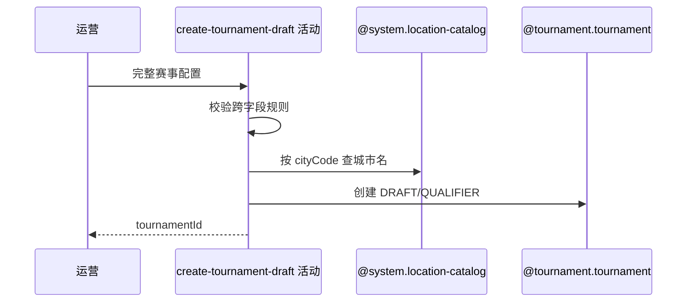

## 概要

校验完整配置、补充城市并初始化赛事草稿。

## 时序图

## 触发条件

后台运营提交完整 TournamentCreateCmd 时执行。

## 活动契约

校验签位、线下轮次、数值、奖金和时间关系，解析城市名称，生成唯一 bizId，并初始化 DRAFT、QUALIFIER 和零锁位。

## 异常分支

| 错误标识 | 触发条件 | 处理 |
|---|---|---|
| 参数/业务规则错误 | 字段、签位、线下轮次、金额、奖金或时间非法 | 不创建 |
| `OPERATION_FAILED` | 枚举无法识别、城市不存在、组装或保存失败 | 事务回滚，不返回编号 |

## 领域依赖

### @system.location-catalog
- 输入：cityCode
- 输出：城市名称或缺失
### @tournament.tournament
- 输入：业务编号与全部合法配置
- 输出：初始化赛事草稿

## 业务动作

A1 校验命令与跨字段规则
A2 解析城市名称
A3 生成赛事身份
A4 初始化草稿与轮次
A5 保存并返回编号

## 详细流程

1. 校验名称、图片、主题、类型、城市、NTRP、性别、签位、线下轮次、组人数、费用、奖金、时间、上限和规则。
2. totalSlots 必须 2–64 的 2 次方，线下轮次签位小于总签位；费用/上限非负，资格赛组至少 2 人。
3. 报名开始早于资格赛开始，各截止不早于对应开始；奖金为逗号分隔非负整数，枚举必须可转换。
4. 按 cityCode 查 cityName，缺城市当前以未处理异常收敛为 OPERATION_FAILED。
5. 生成 bizId，写全部配置，初始化 status=DRAFT、currentRound=QUALIFIER、currentFilledSlots=0，endTime/offlineMeetupId 为空。
6. 单事务保存；成功仅返回编号，不激活、不创建报名或比赛。

## 边界情况

- 城市缺失没有专用业务错误。
- 总签位 2 也合法，只要线下轮次规则满足。
- 草稿可包含未来才会被激活校验发现的其他运营风险。

## 实现提示

写活动 `reads` 为空；城市解析复用已确认 `@system.location-catalog`。
