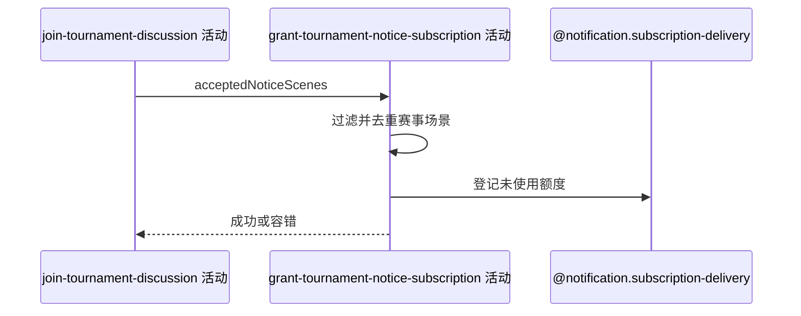

## 概要

为报名时授权的有效赛事通知场景登记订阅额度。

## 时序图

## 触发条件

报名与讨论成员保存完成，且请求带通知授权场景时执行。

## 活动契约

仅对可识别赛事场景去重登记未使用订阅额度；空、无效、重复或保存异常不影响报名成功。

## 异常分支

| 错误标识 | 触发条件 | 处理 |
|---|---|---|
| 跳过 | 场景空、无效或非赛事场景 | 不登记 |
| 内部容错 | 重复额度或保存失败 | 记录日志，报名与讨论保持成功 |

## 领域依赖

### @notification.subscription-delivery
- 输入：用户、赛事通知场景及未使用额度
- 输出：登记结果或容错失败

## 业务动作

A1 解析赛事通知场景
A2 去重有效授权
A3 登记未使用额度
A4 容错完成报名

## 详细流程

1. 将 acceptedNoticeScenes 解析为系统可识别通知场景，过滤非赛事场景和无效值。
2. 本次场景去重后，逐项为当前用户登记未使用额度。
3. 重复或持久化异常在服务内部捕获并记录，不向外抛出主流程失败。
4. 无论是否登记成功，返回前置创建的报名概要。

## 边界情况

- 未授权不妨碍参赛，但后续通知可能无法发送。
- 同一场景重复提交只处理一次。
- 额度登记与报名成功不是强一致。

## 实现提示

写活动 `reads` 为空；使用既有通知领域服务。
