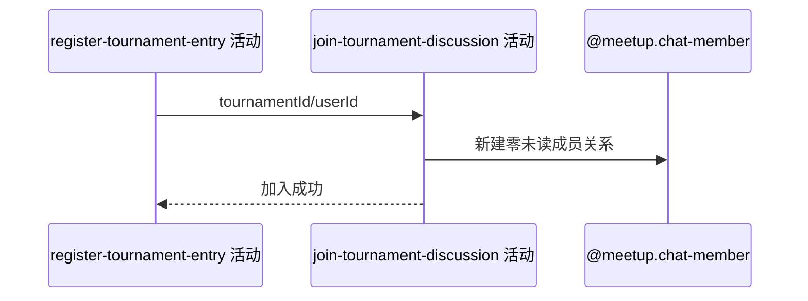

## 概要

把新报名用户加入赛事讨论并初始化阅读状态。

## 时序图

## 触发条件

本人报名已在当前事务建立后执行。

## 活动契约

为赛事频道建立唯一成员关系，初始 unreadCount=0；若报名之前已存在孤立成员记录则报 ALREADY_JOINED_CHAT，并回滚本次报名。

## 异常分支

| 错误标识 | 触发条件 | 处理 |
|---|---|---|
| `ALREADY_JOINED_CHAT` | 已有成员记录但此前无报名 | 保留孤立记录，回滚新报名/搭档变化 |
| `OPERATION_FAILED` | 成员保存失败 | 整体事务回滚 |

## 领域依赖

### @meetup.chat-member
- 输入：赛事 refId 与当前 userId
- 输出：初始零未读成员关系

## 业务动作

A1 检查成员唯一性
A2 建立赛事讨论成员
A3 初始化未读状态

## 详细流程

1. 以 tournamentId 为 refId、当前 userId 检查成员关系。
2. 已存在即报 ALREADY_JOINED_CHAT，不按幂等成功；既有孤立记录不删除。
3. 不存在则创建成员，lastRead 为空、unreadCount=0、joinedAt 为当前时间。
4. 与报名及搭档关系同事务，失败整体回滚。

## 边界情况

- 讨论成员存在但报名不存在被视为异常孤立状态。
- 本活动不补历史评论未读数。
- 评论内容不因报名/加入失败发生变化。

## 实现提示

写入使用 `@meetup.chat-member`，`reads` 为空。
