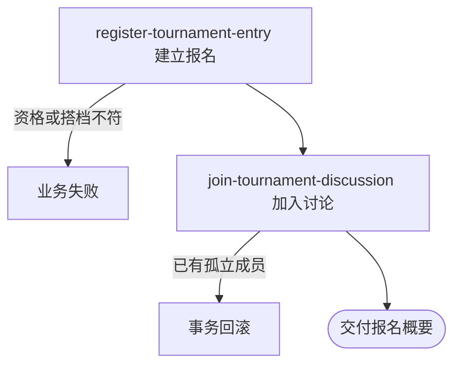

## 概要

为资料和资格合格的登录用户建立资格赛等待匹配报名，并加入赛事讨论。

## 触发

登录用户在赛事报名窗口内提交参赛偏好，希望进入资格赛匹配池并接收后续赛事信息。

## 接口契约

请求体必须包含非空 `tournamentId`、非空 `preferredDistricts`、`courtAbility` 和非空 `availableTimes`；`partnerId` 可选。成功返回新报名概要。

## 业务活动

- register-tournament-entry  校验资格并建立报名
- join-tournament-discussion  加入赛事讨论

## 流程图

## 详细流程

1. 识别当前登录用户，接收赛事编号、地区偏好、订场能力、可比赛时间，以及可选搭档。
2. 取得用户、个人档案和赛事，确认基础资料与网球档案已完善、手机号已绑定，赛事已激活且当前处于报名窗口。
3. 确认本人性别和 NTRP 符合赛事要求，并且在该赛事中不存在任何状态的既有报名。
4. 无可复用搭档报名时分配新参赛编号；搭档已有未绑定其他人的报名时复用其编号，并在需要时补齐搭档的反向关系。
5. 创建本人报名，初始为 `stage=QUALIFY`、`status=WAITING`、`currentRound=QUALIFIER`，两类拒赛次数均为零。
6. 将本人加入赛事讨论，初始未读数为零；若已有孤立讨论成员记录则本次报名整体失败。
7. 返回新报名概要；本流程不登记订阅信息，也不发送通知。

## 异常分支

| 对外失败码 | 触发条件 | 由哪个活动报出 | 补偿动作或超时处理 | 对外提示 |
|---|---|---|---|---|
| 未登录/参数校验错误 | 无有效登录，赛事、地区、订场能力或可比赛时间缺失，或枚举无法解析 | 入口鉴权与校验 | 不建立报名或讨论成员 | 对应登录／必填项／参数提示 |
| `USER_NOT_EXIST` | 登录身份没有对应用户 | register-tournament-entry | 不建立报名 | 用户不存在 |
| `REGISTRATION_INCOMPLETE` | 基础资料仍为默认且网球档案未完善 | register-tournament-entry | 不建立报名 | 请先完善个人信息和网球档案 |
| `USER_INCOMPLETE` | 昵称或头像仍为默认值 | register-tournament-entry | 不建立报名 | 请先完善用户信息，设置头像和昵称 |
| `ONBOARDING_INCOMPLETE` | 网球档案不存在或仍为 `TBC` | register-tournament-entry | 不建立报名 | 请先完善网球档案 |
| `TOURNAMENT_NOT_FOUND` | 指定赛事不存在 | register-tournament-entry | 不建立报名 | 赛事不存在 |
| `TOURNAMENT_STATUS_ILLEGAL` | 赛事不是 `ACTIVE` | register-tournament-entry | 不建立报名 | 赛事当前状态不允许该操作 |
| `TOURNAMENT_REGISTRATION_CLOSED` | 尚未到报名开始，或已经晚于截止时刻 | register-tournament-entry | 不建立报名 | 报名未开放或已截止 |
| `USER_PHONE_REQUIRED` | 报名者没有绑定手机号 | register-tournament-entry | 不建立报名 | 请先绑定手机号 |
| `GENDER_NOT_MATCH` | 报名者性别不符合赛事限制 | register-tournament-entry | 不建立报名 | 性别不符合该约球要求 |
| `TOURNAMENT_NTRP_LEVEL_NOT_MATCH` | 报名者无 NTRP 或与赛事要求数值不等 | register-tournament-entry | 不建立报名 | 您的 NTRP 等级不符合赛事要求 |
| `TOURNAMENT_ALREADY_JOINED` | 本人在赛事中已有任意状态报名 | register-tournament-entry | 保留既有报名 | 您已报名该赛事 |
| `TOURNAMENT_PARTNER_ALREADY_PAIRED` | 搭档报名已经绑定其他用户 | register-tournament-entry | 本人和搭档均不修改 | 该队友已与他人组队，无法选择 |
| `ALREADY_JOINED_CHAT` | 本人已有赛事讨论成员记录但没有报名 | join-tournament-discussion | 回滚本次报名和搭档反向关系，保留既有成员 | 你已加入该聊天 |
| `OPERATION_FAILED` | 报名、搭档关系或讨论成员未完整保存 | register-tournament-entry／join-tournament-discussion | 事务回滚 | 系统异常，请稍后重试 |

## 技术线索

- HTTP：`POST /tournament/entry/join`
- 请求／响应：`TournamentJoinCmd` → `TournamentEntryDTO`
- 调用：`TournamentEntryAppService.join()` → `TournamentEntryService.join()` → `TournamentEntry.create()`
- 准入：`UserProfile.assertCompleted()`、`TournamentPolicy.assertCanJoin()`
- 讨论：`ChatDomainService.join()`
- 事务：应用服务 `@Transactional`
