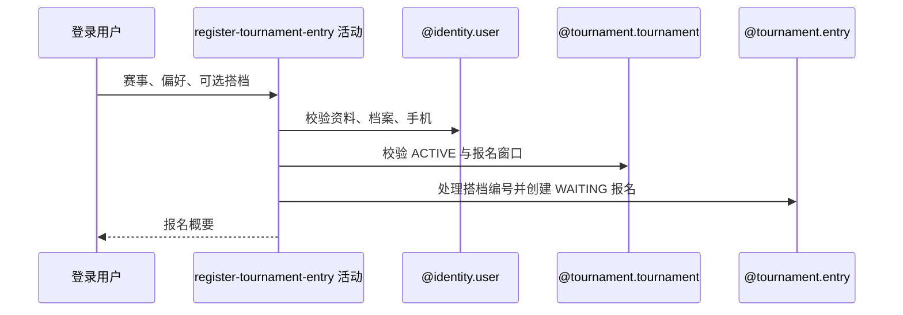

## 概要

校验资料、赛事与搭档资格，建立资格赛等待报名。

## 时序图

## 触发条件

登录用户在 ACTIVE 赛事报名窗口内提交完整匹配偏好时执行。

## 活动契约

要求基础资料、网球档案、手机、性别和精确 NTRP 合格，且本人无任意状态旧报名；按搭档规则分配/复用 entryNo，初始化 QUALIFY/WAITING/QUALIFIER。

## 异常分支

| 错误标识 | 触发条件 | 处理 |
|---|---|---|
| 用户/资料相关错误 | 账户、昵称头像、档案或手机号不完整 | 不建立报名 |
| 赛事/窗口/性别/NTRP 错误 | 赛事缺失、非 ACTIVE、窗口关闭或资格不符 | 不建立报名 |
| `TOURNAMENT_ALREADY_JOINED` | 本人已有任意状态报名 | 保留旧报名 |
| `TOURNAMENT_PARTNER_ALREADY_PAIRED` | 搭档已绑定他人 | 本人搭档均不改 |
| `OPERATION_FAILED` | 报名或搭档反向关系保存失败 | 事务回滚 |

## 领域依赖

### @identity.user
- 输入：当前用户
- 输出：完整资料、网球档案和手机资格
### @tournament.tournament
- 输入：赛事与当前时间
- 输出：状态、窗口、性别和 NTRP 准入
### @tournament.entry
- 输入：本人、可选搭档和三组偏好
- 输出：初始化报名及搭档关系

## 业务动作

A1 校验用户资料与手机
A2 校验赛事报名资格
A3 防止重复报名
A4 分配或复用搭档编号
A5 创建资格赛等待报名

## 详细流程

1. 用户及网球档案必须完善、昵称头像非默认、手机非空；赛事必须 ACTIVE 且当前在报名开始至可选截止内。
2. 本人性别满足限制，NTRP 数值与赛事要求精确相等；任何状态旧报名都阻止重报。
3. 无可复用搭档报名时分配赛事内新 entryNo；搭档已有未绑定他人的报名时复用其编号，并按需补反向 partnerId。
4. 搭档已绑定其他用户时整体拒绝；本人报名写偏好，初始化 stage=QUALIFY、status=WAITING、currentRound=QUALIFIER，两类拒绝计数为零。
5. 本活动与后续讨论加入共享应用事务，后续失败会回滚报名和搭档变化。

## 边界情况

- WITHDRAWN/ELIMINATED 旧报名也阻止再次报名。
- 双打搭档已有合法单边报名时会复用同一 entryNo。
- NTRP 不做区间容差，要求数值相等。

## 实现提示

写活动 `reads` 为空；准入横跨身份、赛事与报名聚合。
