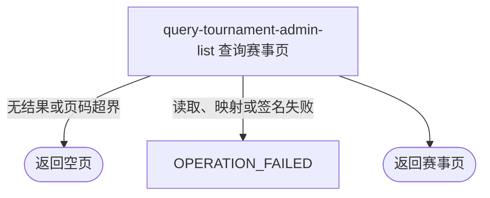

## 概要

按可选条件分页交付后台赛事配置与状态摘要。

## 触发

持有后台共享访问密钥的运营调用方需要浏览一页赛事摘要时发起。

## 接口契约

请求体含可选 `cityCode`、`status`、`ntrpLevel`，以及必填 `pageNum`、`pageSize`。成功返回 `PageDTO<TournamentAdminItemDTO>` 的列表、总数和 `hasMore`。

## 业务活动

- query-tournament-admin-list  筛选、分页并组装后台赛事摘要

## 流程图

## 详细流程

1. 后台共享 API Key 鉴权后，接收可选城市编码、状态、NTRP 和必填页码/每页条数；页码至少 1，每页 1～100。
2. 城市编码和 NTRP 非空白时按保存值精确筛选，状态枚举非空时精确筛选；不校验城市/NTRP 名录，不支持其他条件。
3. 按创建时间倒序执行页码分页，无稳定次级排序；计算全部匹配总数，并以 `pageNum*pageSize < total` 判断 `hasMore`。
4. 映射本页赛事配置、状态、已锁定席位与创建时间，不交付规则描述、奖金、报名/比赛等关联详情。
5. 海报和微信群二维码键映射为 3600 秒签名地址，空键为 `null`；对象存在性不验证。
6. 返回分页列表、总数和 `hasMore`；页码超界正常返回空列表与实际总数。

## 异常分支

| 对外失败码 | 触发条件 | 由哪个活动报出 | 补偿动作或超时处理 | 对外提示 |
|---|---|---|---|---|
| 无权限 | 后台 API Key 缺失或不匹配 | 后台鉴权 | 不查询 | 无权限访问 |
| 参数校验错误 | 页码/页大小缺失或越界 | 入口校验 | 不查询 | 对应 pageNum/pageSize 提示 |
| `OPERATION_FAILED` | 状态枚举无法解析，或读取、映射、签名异常 | query-tournament-admin-list | 终止整体，不返回部分页 | 系统异常，请稍后重试 |
| 无 | 无匹配赛事或页码超界 | query-tournament-admin-list | 返回空列表、真实总数、`hasMore=false` | 查询成功 |

## 技术线索

- HTTP：`POST /tournament/admin/list`
- 请求：`TournamentAdminListCmd`
- 调用：`TournamentAdminAppService.list()` → `TournamentAdminService.pageList()`
- 查询：`TournamentRepositoryImpl.pageList()`，`create_time DESC`
- 映射：`TournamentAppConvertMapper.toTournamentAdminItemDTOList()`
- 图片：`QiniuConfiguration.buildSignedUrl()`，3600 秒
