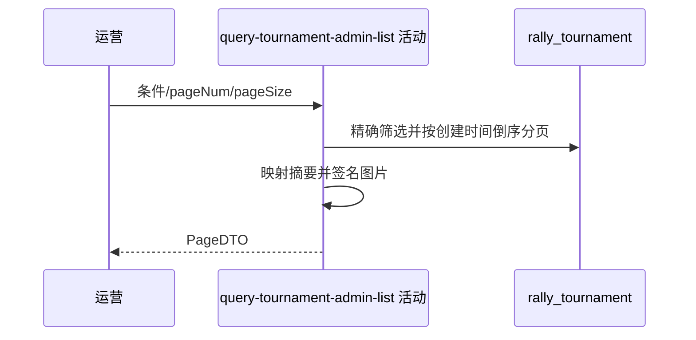

## 概要

筛选、分页并组装后台赛事配置与状态摘要。

## 时序图

## 触发条件

后台运营以合法页码和每页数量浏览赛事清单时执行。

## 活动契约

cityCode、ntrpLevel 非空白时精确匹配，status 精确匹配；pageNum≥1、pageSize 1–100，返回列表、total 和 hasMore。

## 异常分支

| 错误标识 | 触发条件 | 处理 |
|---|---|---|
| 参数校验错误 | 页码或页大小缺失/越界 | 不查询 |
| `OPERATION_FAILED` | 状态转换、读取、映射或签名失败 | 终止整体，不返回部分页 |
| 无 | 无命中或页码超界 | 空列表、真实 total、hasMore=false |

## 领域依赖

无

## 业务动作

A1 解释精确筛选条件
A2 统计并页码分页
A3 映射后台摘要
A4 签名图片地址

## 详细流程

1. 城市编码、NTRP 非空白按保存值精确筛选，status 枚举精确筛选；不查名录，不支持其他条件。
2. 按 create_time DESC 页码分页，无稳定次级排序；统计全部匹配 total。
3. `hasMore = pageNum*pageSize < total`，超界页返回空列表和真实 total。
4. 交付本页配置、状态、锁位和创建时间，不含规则、奖金或关联报名比赛。
5. 海报/群二维码键非空生成 3600 秒签名地址，空键 null，不验证对象存在。

## 边界情况

- 同创建时间记录跨页顺序可能不稳定。
- 不存在的城市/NTRP 只是空结果。
- 任一图片签名异常使整页失败。

## 实现提示

纯查询活动，读取列按 DB snapshot 精确声明。
