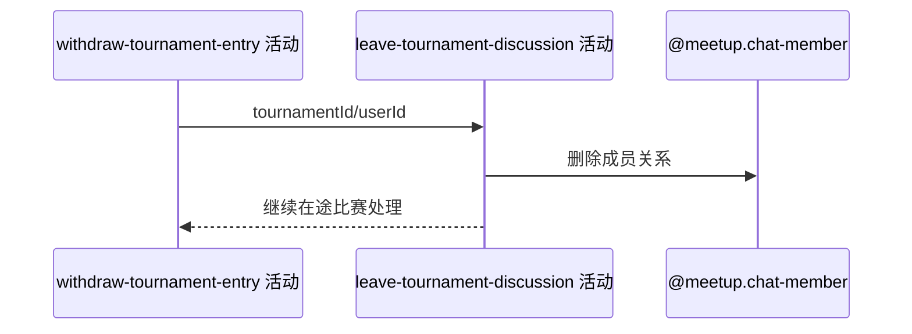

## 概要

删除退赛用户的赛事讨论成员关系并保留历史评论。

## 时序图

## 触发条件

本人报名已在当前事务标记 WITHDRAWN 后执行。

## 活动契约

移除本人在赛事频道的成员/阅读关系；不删除本人或他人的历史评论，失败使整个退赛事务回滚。

## 异常分支

| 错误标识 | 触发条件 | 处理 |
|---|---|---|
| 无 | 成员关系不存在 | 按仓储删除现状继续，不重建 |
| `OPERATION_FAILED` | 删除失败 | 回滚退赛及所有联动 |

## 领域依赖

### @meetup.chat-member
- 输入：赛事 refId 与当前 userId
- 输出：移除成员关系

## 业务动作

A1 定位赛事讨论成员
A2 删除成员与阅读状态
A3 保留历史评论

## 详细流程

1. 以 tournamentId 为讨论 refId、当前 userId 定位成员关系。
2. 删除该成员关系及其中 lastRead/unread 状态，不修改评论表。
3. 与报名退赛和后续比赛处理同事务，持久化异常整体回滚。

## 边界情况

- 历史评论仍保留发布者快照并可被其他成员查看。
- 退赛者之后因旧报名存在不能重新报名加入讨论。
- 本活动不发送离开通知。

## 实现提示

写入使用 `@meetup.chat-member`，`reads` 为空。
