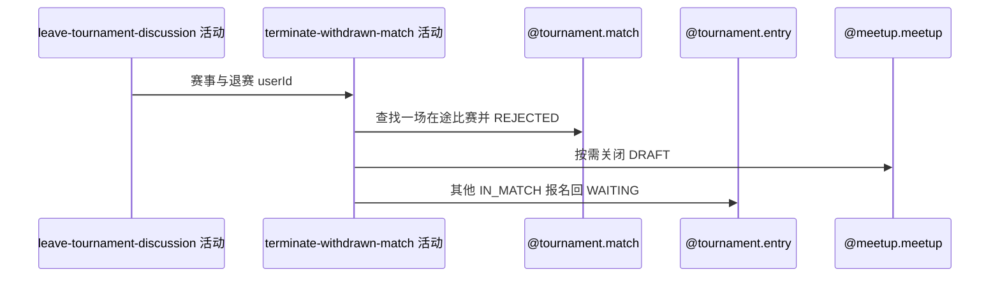

## 概要

终止退赛者的一场在途比赛并释放其他有效报名。

## 时序图

## 触发条件

本人退赛后存在一场状态非 COMPLETED/REJECTED 的比赛时执行；无在途比赛则跳过。

## 活动契约

无排序取得一场在途比赛，以版本条件改 REJECTED，不记录原因/次数；仅关闭 DRAFT 赛约，其他 IN_MATCH 报名回 WAITING，本人保持 WITHDRAWN。

## 异常分支

| 错误标识 | 触发条件 | 处理 |
|---|---|---|
| 跳过 | 无在途比赛 | 保留退赛和退出讨论，成功 |
| `TOURNAMENT_ENTRY_NOT_FOUND` | 某参与者报名缺失 | 整体退赛事务回滚 |
| `TOURNAMENT_MATCH_VERSION_CONFLICT` | 在途比赛并发变化 | 整体回滚 |
| `OPERATION_FAILED` | 比赛、赛约或报名保存失败 | 整体回滚 |

## 领域依赖

### @tournament.match
- 输入：本人一场在途比赛与版本
- 输出：REJECTED 比赛
### @tournament.entry
- 输入：本人及同场其他报名
- 输出：本人 WITHDRAWN，其他 IN_MATCH 回 WAITING
### @meetup.meetup
- 输入：关联赛约
- 输出：仅 DRAFT 时关闭

## 业务动作

A1 查找一场在途比赛
A2 版本化终止比赛
A3 关闭草稿赛约
A4 释放其他报名

## 详细流程

1. 按赛事和 userId 查询状态不为 COMPLETED/REJECTED 的一场比赛，无排序；无结果正常跳过。
2. 以版本条件改 REJECTED，不写 rejectReason、不累计拒绝次数。
3. 关联赛约存在且 DRAFT 时关闭，其他情况保持。
4. 本人报名保持 WITHDRAWN；同场其他报名仅 IN_MATCH 转 WAITING，其他状态保持。任一报名缺失整体失败。
5. 与前两活动共享事务，最终返回 refundTriggered=false，不通知。

## 边界情况

- 数据异常存在多场在途比赛时只处理查到的一场。
- 赛约缺失/非 DRAFT 不阻止退赛。
- 不退款且不发送退赛通知。

## 实现提示

写活动 `reads` 为空；保留无排序单场选择的 Java 现状。
