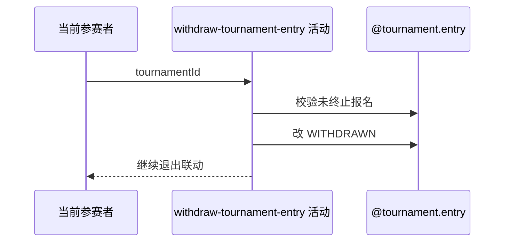

## 概要

将本人有效赛事报名标记为 WITHDRAWN。

## 时序图

## 触发条件

登录参赛者退出本人非 CHAMPION/WITHDRAWN/ELIMINATED 的赛事报名时执行。

## 活动契约

本人报名必须存在且未终止；只改 status=WITHDRAWN，其他字段保留，并与退出讨论及终止在途比赛共享事务。

## 异常分支

| 错误标识 | 触发条件 | 处理 |
|---|---|---|
| `TOURNAMENT_ENTRY_NOT_FOUND` | 本人无报名 | 不修改 |
| `TOURNAMENT_ENTRY_STATUS_ILLEGAL` | 已 CHAMPION、WITHDRAWN 或 ELIMINATED | 保持原状，重复不幂等 |
| `OPERATION_FAILED` | 保存或后续联动失败 | 整体事务回滚 |

## 领域依赖

### @tournament.entry
- 输入：本人报名
- 输出：WITHDRAWN 报名

## 业务动作

A1 取得本人报名
A2 校验未终止
A3 标记退赛

## 详细流程

1. 按赛事和当前用户取得唯一报名，不存在不创建。
2. CHAMPION/WITHDRAWN/ELIMINATED 禁止；PAYING、WAITING、FROZEN、IN_MATCH 等非终态可退赛。
3. 只把 status 改 WITHDRAWN，赛段、轮次、偏好、计数和时间保留。
4. 本步骤尚不最终提交；后续退出讨论/终止比赛失败会使退赛回滚。

## 边界情况

- 重复退赛不是幂等成功。
- PAYING 报名可退但本流程不退款。
- refundTriggered 最终固定 false。

## 实现提示

写入使用 `@tournament.entry`，`reads` 为空。
