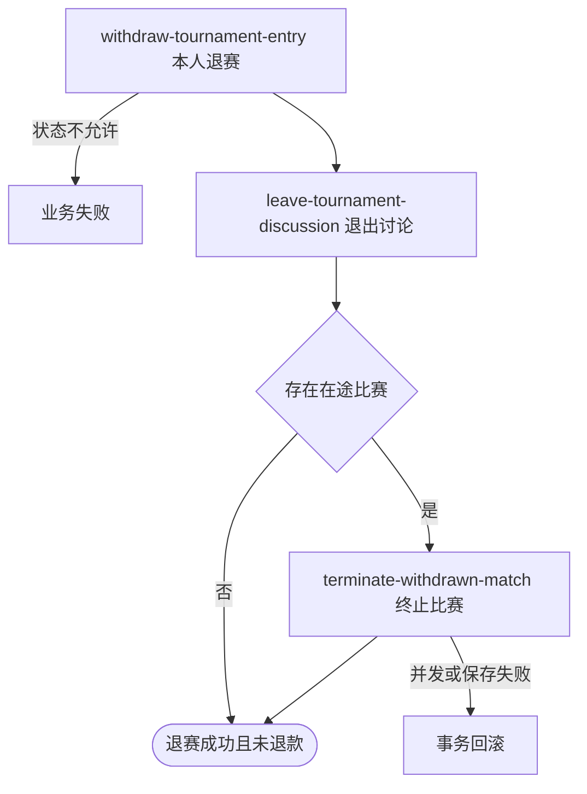

## 概要

让参赛者退出赛事，并事务性退出讨论、终止一场在途比赛和释放其他参赛者。

## 触发

登录参赛者决定退出指定赛事，不再参与当前或后续匹配。

## 接口契约

请求体必须包含非空 `tournamentId`。成功返回退赛结果，目前 `refundTriggered` 固定为 `false`。

## 业务活动

- withdraw-tournament-entry  将本人报名置为已退赛
- leave-tournament-discussion  退出赛事讨论
- terminate-withdrawn-match  终止在途比赛并释放其他报名

## 流程图

## 详细流程

1. 识别当前登录用户，接收赛事编号并取得本人报名。
2. 确认报名不是 `CHAMPION`、`WITHDRAWN` 或 `ELIMINATED`，将本人状态改为 `WITHDRAWN`，其余报名字段保持不变。
3. 删除本人赛事讨论成员关系，保留既有评论。
4. 查找本人在该赛事中的一场未完成或终止比赛；没有时直接完成退赛。
5. 找到时以版本条件将比赛改为 `REJECTED`，不记录拒赛理由且不累计拒赛次数。
6. 仅关闭仍为 `DRAFT` 的关联赛约，并把同场其他仍为 `IN_MATCH` 的报名改为 `WAITING`；本人保持 `WITHDRAWN`。
7. 事务完成后返回 `refundTriggered=false`，不发送退赛通知。

## 异常分支

| 对外失败码 | 触发条件 | 由哪个活动报出 | 补偿动作或超时处理 | 对外提示 |
|---|---|---|---|---|
| 未登录/参数校验错误 | 无有效登录或赛事编号空白 | 入口鉴权与校验 | 不读取/修改 | 统一登录提示／赛事ID不能为空 |
| `TOURNAMENT_ENTRY_NOT_FOUND` | 指定赛事没有本人报名，或在途比赛某参与者报名缺失 | withdraw-tournament-entry／terminate-withdrawn-match | 事务回滚 | 报名记录不存在 |
| `TOURNAMENT_ENTRY_STATUS_ILLEGAL` | 本人报名已为 `CHAMPION`、`WITHDRAWN` 或 `ELIMINATED` | withdraw-tournament-entry | 所有对象不变 | 报名当前状态不允许该操作 |
| 无在途比赛 | 本人没有状态非 `COMPLETED`、`REJECTED` 的比赛 | terminate-withdrawn-match | 保留本人退赛和退出讨论，正常返回 | 退赛成功 |
| 赛约无需关闭 | 比赛无赛约、赛约不存在或状态不是 `DRAFT` | terminate-withdrawn-match | 不创建或改变该活动，继续退赛 | 退赛成功 |
| 报名无需释放 | 同场某报名当前不是 `IN_MATCH` | terminate-withdrawn-match | 保留该报名现状 | 退赛成功 |
| `TOURNAMENT_MATCH_VERSION_CONFLICT` | 在途比赛已被并发修改 | terminate-withdrawn-match | 整体事务回滚 | 比赛状态已变更，请刷新后重试 |
| `OPERATION_FAILED` | 报名、讨论成员、比赛、赛约或其他报名未完整保存 | 任一业务活动 | 整体事务回滚 | 系统异常，请稍后重试 |

## 技术线索

- HTTP：`POST /tournament/entry/withdraw`
- 请求／响应：`TournamentWithdrawCmd` → `TournamentWithdrawResultDTO(false)`
- 调用：`TournamentEntryAppService.withdraw()` → `TournamentEntryService.withdraw()`／`ChatDomainService.quit()`／`TournamentMatchFlowService.closeActiveMatchOnWithdraw()`
- 在途比赛：`TournamentMatchRepository.findActiveMatchByTournamentAndUser()`，排除 `COMPLETED`、`REJECTED` 后无排序取一场
- 并发：`TournamentMatchRepository.updateWithVersion()`
- 事务：应用服务 `@Transactional`，联动服务 `@Transactional(rollbackFor = Exception.class)`
