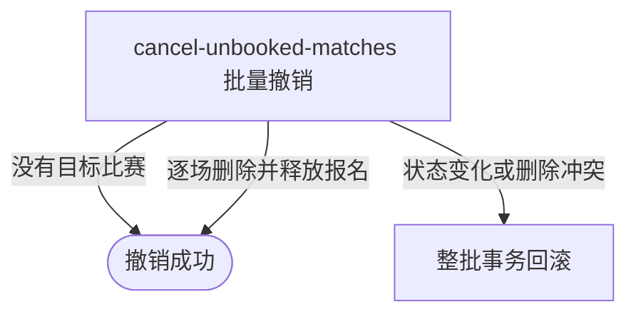

## 概要

让运营批量删除指定赛事尚未提交赛约的比赛，并将仍在比赛中的报名退回匹配池。

## 触发

运营需要清理指定赛事尚处于匹配完成或等待订场阶段的比赛，让相应参赛单元重新进入匹配池。

## 接口契约

请求体必须包含非空 `tournamentId`。操作按赛事批量执行，不能指定单场、预览数量或排除比赛；成功返回无数据响应。

## 业务活动

- cancel-unbooked-matches  删除未订场比赛并释放报名

## 流程图

## 详细流程

1. 接收赛事编号，确认赛事存在且已经设置当前轮次。
2. 查询赛事下全部比赛，只选取当前状态为 `MATCHED` 或 `BOOKING` 的比赛；没有目标时正常完成。
3. 逐场重新读取比赛及参与关系，再次确认状态仍可撤销。
4. 按可撤销状态条件删除比赛和全部参与关系；删除失败视为并发冲突。
5. 逐个原参与者查找赛事报名，仅把仍为 `IN_MATCH` 的报名改为 `WAITING`，其余字段和状态保持不变。
6. 所有目标比赛在同一事务中完成后返回成功；不处理关联赛约、不通知参赛者，也不自动重新匹配。

## 异常分支

| 对外失败码 | 触发条件 | 由哪个活动报出 | 补偿动作或超时处理 | 对外提示 |
|---|---|---|---|---|
| 无权限/参数校验错误 | 无运营权限或赛事编号空白 | 入口鉴权与校验 | 不读取/修改 | 无权限访问／赛事ID不能为空 |
| `TOURNAMENT_NOT_FOUND` | 指定赛事不存在 | cancel-unbooked-matches | 不删除比赛或修改报名 | 赛事不存在 |
| `PARAM_ERROR` | 指定赛事尚未设置当前轮次 | cancel-unbooked-matches | 不删除比赛或修改报名 | 参数错误 |
| 无目标比赛 | 赛事下没有 `MATCHED` 或 `BOOKING` 比赛 | cancel-unbooked-matches | 正常完成，无变更 | 撤销成功 |
| `TOURNAMENT_ENTRY_NOT_FOUND` | 初次选中的比赛在逐场读取时已不存在 | cancel-unbooked-matches | 本批事务回滚 | 报名记录不存在 |
| `TOURNAMENT_MATCH_CANCEL_FORBIDDEN` | 逐场处理时比赛已不再是 `MATCHED` 或 `BOOKING` | cancel-unbooked-matches | 本批事务回滚 | 仅未提交订场信息的比赛可以取消 |
| `TOURNAMENT_MATCH_VERSION_CONFLICT` | 比赛通过检查后无法按可撤销状态删除 | cancel-unbooked-matches | 本批事务回滚 | 比赛状态已变更，请刷新后重试 |
| 报名缺失或状态不同 | 原参与者报名不存在或不再是 `IN_MATCH` | cancel-unbooked-matches | 跳过该报名，继续并可成功提交 | 撤销成功 |
| `OPERATION_FAILED` | 比赛、参与关系删除或报名保存未完整完成 | cancel-unbooked-matches | 本批事务回滚 | 系统异常，请稍后重试 |

## 技术线索

- HTTP：`POST /tournament/admin/match/cancel`
- 请求：`TournamentMatchCancelCmd`
- 调用：`TournamentAdminAppService.cancelUnsubmittedTournamentMatches()` → `TournamentBatchMatchService.cancelUnsubmittedMatches()` → `cancelUnsubmittedMatch()`
- 删除：`TournamentMatchRepository.deleteUnsubmittedWithParticipants()`，按比赛编号与 `MATCHED/BOOKING` 状态条件物理删除
- 事务：批量方法 `@Transactional`；同类内部逐场调用共享外层事务
