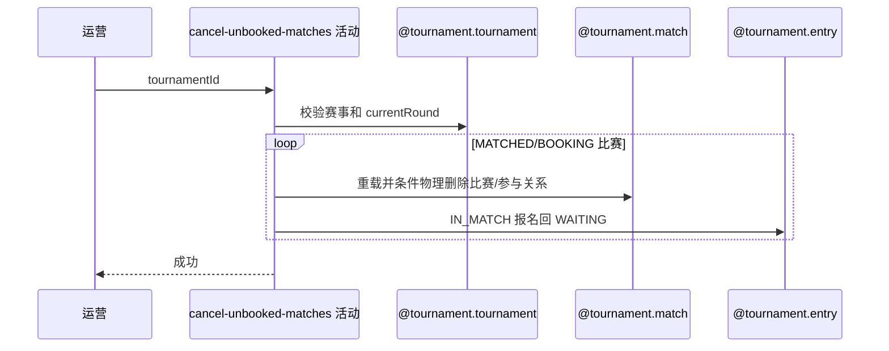

## 概要

批量物理删除未提交赛约的比赛并释放有效报名。

## 时序图

## 触发条件

运营批量撤销指定赛事全部 MATCHED 或 BOOKING 比赛时执行。

## 活动契约

赛事存在且 currentRound 非空；对初筛目标逐场复核并按状态条件物理删除比赛/参与关系，只把对应 IN_MATCH 报名退回 WAITING，整批同事务。

## 异常分支

| 错误标识 | 触发条件 | 处理 |
|---|---|---|
| `TOURNAMENT_NOT_FOUND`/`PARAM_ERROR` | 赛事缺失或 currentRound 为空 | 不修改 |
| 无目标 | 无 MATCHED/BOOKING 比赛 | 幂等成功 |
| `TOURNAMENT_ENTRY_NOT_FOUND` | 初筛比赛重载时已不存在 | 整批回滚 |
| `TOURNAMENT_MATCH_CANCEL_FORBIDDEN`/版本冲突 | 状态已变或条件删除失败 | 整批回滚 |
| `OPERATION_FAILED` | 删除/报名保存不完整 | 整批回滚 |

## 领域依赖

### @tournament.tournament
- 输入：赛事编号
- 输出：存在性与 currentRound
### @tournament.match
- 输入：MATCHED/BOOKING 比赛
- 输出：物理删除比赛和参与关系
### @tournament.entry
- 输入：原参与者报名
- 输出：仅 IN_MATCH 回 WAITING

## 业务动作

A1 校验赛事当前轮次
A2 初筛未订场比赛
A3 逐场复核并条件删除
A4 释放有效报名

## 详细流程

1. 赛事必须存在且 currentRound 已设置；查询其全部比赛并筛 MATCHED/BOOKING，无目标正常成功。
2. 每个目标重载比赛和参与者，再次要求状态仍 MATCHED/BOOKING。
3. 按 bizId 与允许状态条件物理删除比赛及全部参与关系；删除失败视为并发冲突。
4. 对原参与者报名逐个查找，仅 IN_MATCH 改 WAITING；缺失或其他状态跳过。
5. 所有目标共享一个批量事务，任一比赛冲突使整批回滚；不处理关联赛约、不通知、不自动重匹配。

## 边界情况

- 这是物理删除，不保留比赛审计记录。
- 报名缺失不会失败，与初筛比赛重载缺失语义不同。
- 已进入 SCHEDULED 或更后状态绝不撤销。

## 实现提示

写活动 `reads` 为空；整批事务不同于超时任务的逐场隔离。
