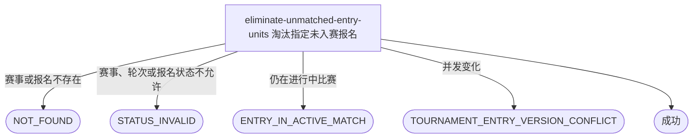

## 概要

让运营淘汰一个当前轮次尚未进入比赛的指定参赛者。

## 触发

后台运营在自办赛事详情的参与者用户行点击淘汰；一次请求只处理 `tournamentId+userId` 定位的一条报名。原赛事级批量行为不再保留，同一请求重复到达时按目标报名最新状态重新校验。

## 接口契约

### 请求参数

| 字段 | 类型 | 必填 | 约束 |
|---|---|---|---|
| `tournamentId` | String | 是 | 非空，必须对应已激活赛事。 |
| `userId` | String | 是 | 非空，与赛事编号共同定位目标报名。 |

### 成功响应

无

## 业务活动

- eliminate-unmatched-entry-units  校验指定用户当前轮次报名未进入进行中比赛，并仅将该报名淘汰

## 流程图

## 详细流程

1. 接收并校验赛事编号和用户编号。
2. 在与赛事匹配共享的同步边界中确认赛事为 `ACTIVE` 且当前轮次存在。
3. 按赛事编号和用户编号取得目标报名；报名不存在时拒绝。
4. 确认报名处于赛事当前轮次，且当前状态为 `WAITING` 或 `FROZEN`。
5. 确认目标用户没有参与本赛事状态为 `MATCHED/BOOKING/SCHEDULED/PENDING_PLAY/PENDING_CONFIRM` 的比赛；`COMPLETED/REJECTED` 历史参与关系不阻止操作。
6. 以报名当前轮次和允许状态为条件，把目标用户报名更新为 `ELIMINATED`。
7. 只提交该用户报名变化；双打搭档、比赛、赛约和其他报名保持原状，成功后返回无数据响应。

## 异常分支

| 对外失败码 | 触发条件 | 由哪个活动报出 | 补偿动作或超时处理 | 对外提示 |
|---|---|---|---|---|
| 无权限/参数校验错误 | 运营访问无效，或赛事编号/用户编号为空 | 流程 | 不读取或修改 | 无权限访问／赛事ID和用户ID不能为空 |
| `TOURNAMENT_NOT_FOUND` | 指定赛事不存在 | eliminate-unmatched-entry-units | 不修改 | 赛事不存在 |
| `TOURNAMENT_STATUS_INVALID` | 赛事不是 `ACTIVE` 或当前轮次缺失 | eliminate-unmatched-entry-units | 不修改 | 当前赛事不能淘汰未入赛参赛者 |
| `TOURNAMENT_ENTRY_NOT_FOUND` | `tournamentId+userId` 未找到报名 | eliminate-unmatched-entry-units | 不补建 | 参赛者报名不存在 |
| `TOURNAMENT_ENTRY_STATUS_INVALID` | 报名不在赛事当前轮次或不是 `WAITING/FROZEN` | eliminate-unmatched-entry-units | 不修改 | 当前报名状态或轮次不能淘汰 |
| `TOURNAMENT_ENTRY_IN_ACTIVE_MATCH` | 用户参与本赛事任一进行中比赛 | eliminate-unmatched-entry-units | 不修改报名或比赛 | 参赛者仍在比赛中，不能淘汰 |
| `TOURNAMENT_ENTRY_VERSION_CONFLICT` | 校验后报名被匹配或状态、轮次变化 | eliminate-unmatched-entry-units | 整个事务回滚 | 参赛者状态已变化，请刷新后重试 |

## 技术线索

- 接口：`POST /tournament/admin/entry/eliminate-unmatched`
- 请求字段：`tournamentId`、`userId`
- 允许报名状态：`WAITING/FROZEN`
- 阻止淘汰的比赛状态：`MATCHED/BOOKING/SCHEDULED/PENDING_PLAY/PENDING_CONFIRM`
- 后台入口：自办赛事详情参与者表格的用户行最后一列
