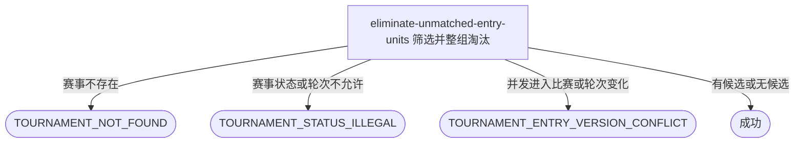

## 概要

让运营整组淘汰当前轮次未进入比赛的参赛者。

## 触发

运营人员在当前轮次匹配完成后通过后台发起；一次请求处理指定赛事当前轮次的全部候选参赛单元。重复提交时，已淘汰报名不再进入候选；没有候选时幂等成功。

## 接口契约

### 请求参数

| 字段 | 类型 | 必填 | 约束 |
|---|---|---|---|
| `tournamentId` | String | 是 | 非空，必须对应状态为 `ACTIVE` 且已设置当前轮次的赛事。 |

### 成功响应

无

## 业务活动

- eliminate-unmatched-entry-units  筛选当前轮次未参加在途比赛的完整参赛单元并整组淘汰

## 流程图

## 详细流程

1. 接收运营提交的赛事编号，确认赛事存在、状态为激活且已经设置当前轮次。
2. 读取赛事当前轮次报名，按参赛编号汇总为单打或双打参赛单元，并读取赛事全部在途比赛及参与关系。
3. 排除成员不完整、成员状态不全为 `WAITING/FROZEN`、任一成员参加在途比赛的参赛单元；其他轮次、待支付、比赛中和终态报名不纳入候选。
4. 再次确认赛事仍处于原当前轮次、候选报名仍为 `WAITING/FROZEN`，且没有候选成员并发进入新比赛。
5. 将每个候选参赛单元下的全部报名整组改为 `ELIMINATED`，其他报名字段保持不变。
6. 所有候选单元在同一事务中提交；没有候选时不产生变更并直接成功。
7. 返回无数据响应；不推进赛事轮次、不修改比赛，也不发送通知。

## 异常分支

| 对外失败码 | 触发条件 | 由哪个活动报出 | 补偿动作或超时处理 | 对外提示 |
|---|---|---|---|---|
| 无权限/参数校验错误 | 运营访问无效或 `tournamentId` 空白 | 流程 | 不读取或修改 | 无权限访问／赛事ID不能为空 |
| `TOURNAMENT_NOT_FOUND` | 指定赛事不存在 | eliminate-unmatched-entry-units | 不修改报名 | 赛事不存在 |
| `TOURNAMENT_STATUS_ILLEGAL` | 赛事不是 `ACTIVE` | eliminate-unmatched-entry-units | 不修改报名 | 赛事当前状态不允许该操作 |
| `PARAM_ERROR` | 赛事没有当前轮次 | eliminate-unmatched-entry-units | 不修改报名 | 参数错误 |
| 无候选 | 当前轮次没有完整且未参加在途比赛的 `WAITING/FROZEN` 单元 | eliminate-unmatched-entry-units | 正常完成，无变更 | 淘汰成功 |
| `TOURNAMENT_ENTRY_VERSION_CONFLICT` | 筛选后轮次变化、候选报名改变状态或候选成员进入新比赛 | eliminate-unmatched-entry-units | 整个事务回滚 | 报名状态已变更，请刷新后重试 |
| `OPERATION_FAILED` | 任一候选参赛单元未能整组保存 | eliminate-unmatched-entry-units | 整个事务回滚 | 系统异常，请稍后重试 |

## 技术线索

- 新入口：`POST /tournament/admin/entry/eliminate-unmatched`
- 请求字段：`tournamentId`
- 候选报名状态：`WAITING`、`FROZEN`
- 在途比赛状态：`MATCHED`、`BOOKING`、`SCHEDULED`、`PENDING_PLAY`、`PENDING_CONFIRM`
