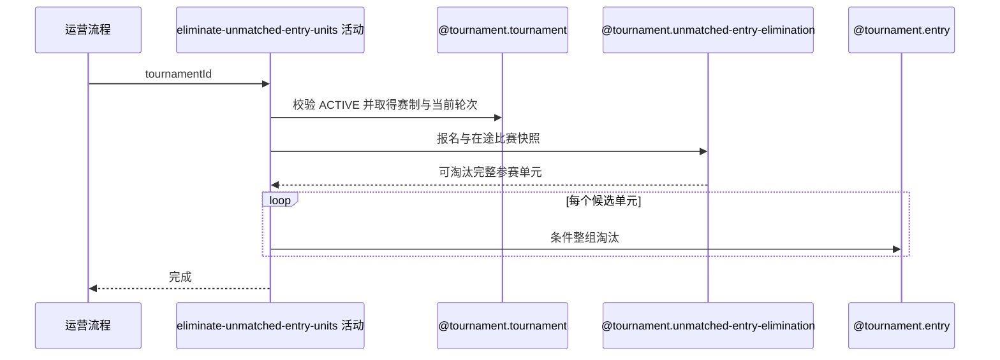

## 概要

判定当前轮次未入赛单元并整组淘汰报名。

## 时序图

## 触发条件

运营要收口一个激活赛事当前轮次中尚未进入比赛的 `WAITING/FROZEN` 参赛单元时执行。

## 活动契约

### 入参

| 字段 | 类型 | 必填 | 约束 |
|---|---|---|---|
| `tournamentId` | 字符串 | 是 | 已通过非空校验。 |

### 成功返回

无

## 异常分支

| 错误标识 | 触发条件 | 来源 |
|---|---|---|
| `TOURNAMENT_NOT_FOUND` | 指定赛事不存在 | eliminate-unmatched-entries 流程 `TOURNAMENT_NOT_FOUND` 一行 |
| `TOURNAMENT_STATUS_ILLEGAL` | 赛事最新状态不是 `ACTIVE` | eliminate-unmatched-entries 流程 `TOURNAMENT_STATUS_ILLEGAL` 一行 |
| `PARAM_ERROR` | 赛事当前轮次为空 | eliminate-unmatched-entries 流程 `PARAM_ERROR` 一行 |
| `TOURNAMENT_ENTRY_VERSION_CONFLICT` | 决策后赛事轮次、候选报名状态或在途比赛关系发生变化 | eliminate-unmatched-entries 流程 `TOURNAMENT_ENTRY_VERSION_CONFLICT` 一行 |
| `OPERATION_FAILED` | 任一候选参赛单元未能整组保存 | eliminate-unmatched-entries 流程 `OPERATION_FAILED` 一行 |

## 领域依赖

### @tournament.tournament

- 输入：赛事编号与执行当前轮次运营淘汰的意图
- 输出：赛事为 `ACTIVE` 且当前轮次存在时返回比赛类型和当前轮次；赛事缺失、状态不允许或轮次缺失时返回失败结论

### @tournament.unmatched-entry-elimination

- 输入：赛事比赛类型、当前轮次、赛事全部报名快照、全部在途比赛及参与者快照
- 输出：返回成员完整、全员为当前轮次 `WAITING/FROZEN` 且无人参加在途比赛的参赛单元集合；异常或不符合条件的单元作为排除结果

### @tournament.entry

- 输入：候选参赛单元下的报名、预期轮次、预期来源状态与运营淘汰意图
- 输出：条件仍满足时整组报名迁移为 `ELIMINATED`；任一成员条件变化时返回冲突结论

## 业务动作

A1 校验赛事激活状态并取得比赛类型和当前轮次
A2 加载赛事报名与在途比赛参与快照
A3 请求领域服务判定完整的未入赛候选单元
A4 复核赛事轮次与候选单元并条件整组淘汰
A5 完成本批淘汰

## 详细流程

1. `A1` 加载赛事；缺失、非 `ACTIVE` 或当前轮次为空分别拒绝，成功时保留 `matchType+currentRound` 快照。
2. `A2` 加载赛事全部报名，以及状态为 `MATCHED/BOOKING/SCHEDULED/PENDING_PLAY/PENDING_CONFIRM` 的全部比赛参与者；已完成、已终止和已删除比赛不算在途。
3. `A3` 按 `entryNo` 分组。单打只接受恰好一人；双打只接受恰好两人、共享编号且互为搭档。完整单元还必须全员轮次等于赛事当前轮次、状态为 `WAITING/FROZEN`，且没有成员出现在在途参与快照中。
4. 无候选时直接进入 `A5`。有候选时，`A4` 先确认赛事仍为原当前轮次，再对每个单元验证全部成员仍处于预期轮次与 `WAITING/FROZEN`，且没有并发在途比赛，然后调用报名淘汰命令并整组保存。
5. `A4` 任一复核或条件保存失败均报并发冲突，本批已经发生的报名变化全部回滚；所有单元成功后 `A5` 返回无数据。

## 边界情况

- `IN_MATCH` 但没有在途比赛的报名作为异常数据排除，不借本活动直接淘汰。
- `WAITING/FROZEN` 仍出现在在途参与关系时，以比赛关系为准排除整个单元。
- 其他轮次、`PAYING/CHAMPION/ELIMINATED/WITHDRAWN` 报名全部排除。
- 成员缺失、双打搭档不对称、共享编号异常或同编号人数超出赛制要求时整组排除。
- 没有候选是幂等成功，不返回数量或名单。

## 实现提示

写活动 `reads` 为空；跨实例候选规则下沉领域服务。运营淘汰与现有匹配入口在同一应用服务内串行，并以条件更新和保存前在途关系复核收敛并发；任一条件未命中抛出整批冲突。
