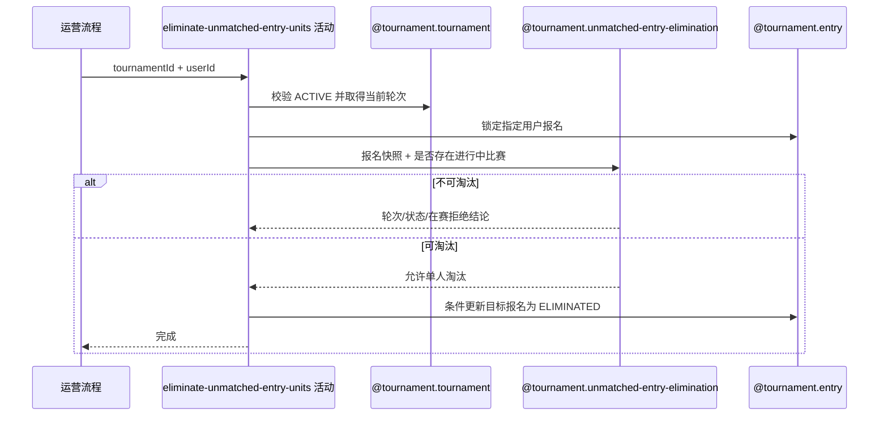

## 概要

校验并淘汰一个指定未入赛报名。

## 时序图

## 触发条件

运营要淘汰一个激活赛事当前轮次中的指定用户时执行；请求已提供非空 `tournamentId+userId`，目标报名必须为 `WAITING/FROZEN` 且用户不在进行中比赛。

## 活动契约

### 入参

| 字段 | 类型 | 必填 | 约束 |
|---|---|---|---|
| `tournamentId` | 字符串 | 是 | 已通过非空校验。 |
| `userId` | 字符串 | 是 | 已通过非空校验，只处理该用户。 |

### 成功返回

无

## 异常分支

| 错误标识 | 触发条件 | 来源 |
|---|---|---|
| `TOURNAMENT_NOT_FOUND` | 指定赛事不存在 | eliminate-unmatched-entries 流程 `TOURNAMENT_NOT_FOUND` 一行 |
| `TOURNAMENT_STATUS_INVALID` | 赛事最新状态不是 `ACTIVE` 或当前轮次为空 | eliminate-unmatched-entries 流程 `TOURNAMENT_STATUS_INVALID` 一行 |
| `TOURNAMENT_ENTRY_NOT_FOUND` | 指定赛事下不存在该用户报名 | eliminate-unmatched-entries 流程 `TOURNAMENT_ENTRY_NOT_FOUND` 一行 |
| `TOURNAMENT_ENTRY_STATUS_INVALID` | 报名轮次不等于赛事当前轮次，或状态不是 `WAITING/FROZEN` | eliminate-unmatched-entries 流程 `TOURNAMENT_ENTRY_STATUS_INVALID` 一行 |
| `TOURNAMENT_ENTRY_IN_ACTIVE_MATCH` | 目标用户参与本赛事任一进行中比赛 | eliminate-unmatched-entries 流程 `TOURNAMENT_ENTRY_IN_ACTIVE_MATCH` 一行 |
| `TOURNAMENT_ENTRY_VERSION_CONFLICT` | 决策后目标报名状态或轮次发生变化 | eliminate-unmatched-entries 流程 `TOURNAMENT_ENTRY_VERSION_CONFLICT` 一行 |

## 领域依赖

### @tournament.tournament

- 输入：赛事编号与执行当前轮次运营淘汰的意图
- 输出：赛事为 `ACTIVE` 且当前轮次存在时返回当前轮次；赛事缺失、状态不允许或轮次缺失时返回失败结论

### @tournament.unmatched-entry-elimination

- 输入：赛事当前轮次、指定用户报名的状态与轮次快照、该用户是否参与本赛事进行中比赛
- 输出：返回允许淘汰、报名状态/轮次不允许或仍在进行中比赛的单人判定结论

### @tournament.entry

- 输入：指定用户报名、预期赛事当前轮次与运营淘汰意图
- 输出：条件仍满足时只将该报名迁移为 `ELIMINATED`；状态或轮次变化时返回冲突结论

## 业务动作

A1 校验赛事激活状态并取得当前轮次
A2 按赛事编号和用户编号锁定目标报名
A3 查询目标用户是否参与本赛事进行中比赛
A4 请求领域服务判定指定报名是否允许淘汰
A5 按预期轮次和允许状态条件淘汰目标报名
A6 完成单人淘汰

## 详细流程

1. `A1` 加载赛事；缺失、非 `ACTIVE` 或当前轮次为空时分别拒绝，成功时保留当前轮次快照。
2. `A2` 按 `tournamentId+userId` 锁定一条报名；不存在时拒绝，不按 entryNo 加载或扩展到搭档。
3. `A3` 只查询目标 userId 在本赛事状态为 `MATCHED/BOOKING/SCHEDULED/PENDING_PLAY/PENDING_CONFIRM` 的比赛参与关系；`COMPLETED/REJECTED` 不算在赛。
4. `A4` 使用报名状态、报名轮次、赛事当前轮次和在赛事实判定；轮次或状态不允许与仍在比赛中分档失败。
5. `A5` 仅在允许时调用报名淘汰命令，以业务编号、预期轮次和 `WAITING/FROZEN` 为条件更新为 `ELIMINATED`；条件未命中报并发冲突。
6. `A6` 只在目标报名成功更新后返回；`A1-A5` 在同一事务内，且应用服务与匹配入口共享同步边界。

## 边界情况

- 双打只淘汰指定 userId，搭档报名、partnerId 和共享 entryNo 均不修改。
- `WAITING/FROZEN` 报名只要目标 userId 仍出现在进行中比赛就拒绝，以比赛关系保护异常状态数据。
- `IN_MATCH/PAYING/CHAMPION/ELIMINATED/WITHDRAWN` 以及非当前轮次报名均拒绝，不借本活动纠正异常状态。
- 查询范围只覆盖一条报名和目标用户的比赛参与关系，不扫描其他报名或计算候选集合。

## 实现提示

写活动 `reads` 为空；跨实例候选规则下沉领域服务。运营淘汰与现有匹配入口在同一应用服务内串行，并以条件更新和保存前在途关系复核收敛并发；任一条件未命中抛出整批冲突。
