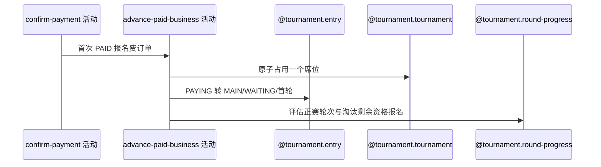

## 概要

为首次报名费付款占用正赛席位并推进报名和赛事轮次。

## 时序图

## 触发条件

首次确认 PAID 且 bizType 为赛事报名费时执行。

## 活动契约

关联报名必须 PAYING；原子占一个未满正赛席位，报名转 MAIN/WAITING 和总签位对应首轮，并按资格赛完成度/满位推进赛事与淘汰剩余资格等待报名。

## 异常分支

| 错误标识 | 触发条件 | 处理 |
|---|---|---|
| 报名/赛事不存在 | refId 无报名或赛事 | 回执失败；订单可能已 PAID |
| `TOURNAMENT_SLOTS_FULL` | 原子占位失败 | 报名可能仍 PAYING，订单可能已 PAID |
| `TOURNAMENT_ENTRY_STATUS_ILLEGAL` | 报名非 PAYING | 回执失败，先前变化可能保留 |
| 轮次配置无效/`OPERATION_FAILED` | 总签位无法映射或保存不完整 | 尽力标回执 FAILED，不保证前序回滚 |

## 领域依赖

### @tournament.entry
- 输入：订单 refBizId 对应报名
- 输出：MAIN/WAITING 与正赛首轮
### @tournament.tournament
- 输入：赛事当前锁位和总签位
- 输出：原子锁位+1
### @tournament.round-progress
- 输入：资格赛完成数和锁位结果
- 输出：正赛轮次与剩余资格报名淘汰

## 业务动作

A1 解析报名费关联
A2 原子占用正赛席位
A3 推进付款报名
A4 评估赛事正赛轮次

## 详细流程

1. 仅首次 PAID 的 TOURNAMENT_ENTRY_FEE 分流；读取关联报名和赛事。
2. 以当前锁位小于 totalSlots 为条件原子加一，失败报席位已满。
3. 要求报名仍 PAYING，改 stage=MAIN、status=WAITING、currentRound=由 totalSlots 映射的首轮，并记录 paidTime。
4. 若资格赛比赛完成且锁位已满，赛事进入正赛首轮，并把仍 QUALIFY/WAITING 报名改 ELIMINATED。
5. 回调处理内部捕获本活动异常，因此支付单 PAID 或席位等先前变化可能提交，回执标 FAILED 等待重试。

## 边界情况

- 重复已 PAID 回执不再调用本活动。
- 订单 PAID 与报名推进不是严格原子，恢复任务用于补偿部分停滞。
- 不支持的 totalSlots 会在首轮映射失败。

## 实现提示

写活动 `reads` 为空；回调路径的内部捕获形成特殊非原子边界。
