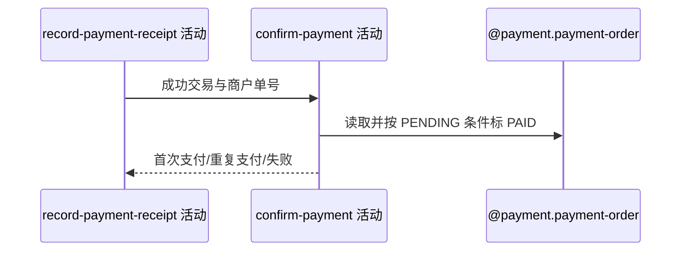

## 概要

按成功回执确认支付单，并区分首次付款与重复通知。

## 时序图

## 触发条件

回执为交易成功且商户单号非空时执行。

## 活动契约

支付单 PENDING 时写 PAID、渠道流水与本地时间并标首次；已 PAID 幂等重复，不推进业务；CLOSED/FAILED 拒绝。

## 异常分支

| 错误标识 | 触发条件 | 处理 |
|---|---|---|
| `PAYMENT_ORDER_NOT_FOUND` | 商户单号无订单 | 回执失败 |
| 重复成功 | 本地已 PAID | 不重复写、不推进，回执成功 |
| `PAYMENT_STATUS_ILLEGAL` | 本地 CLOSED/FAILED | 保持原状，回执失败 |
| `OPERATION_FAILED` | 状态保存失败 | 回执失败；实际条件更新结果当前未检查 |

## 领域依赖

### @payment.payment-order
- 输入：商户单号、渠道流水和确认时间
- 输出：首次 PAID、重复 PAID 或非法状态

## 业务动作

A1 按商户单号取得支付单
A2 判断当前状态
A3 条件确认首次支付
A4 抑制重复业务推进

## 详细流程

1. 按 refId/outTradeNo 读取支付单，不存在使回执 FAILED。
2. 已 PAID 视为重复成功，直接返回“非首次”；CLOSED/FAILED 报状态非法。
3. PENDING 时设置 PAID、channelTransactionId 和本地 payTime，并执行只允许 PENDING 的条件更新。
4. 当前实现忽略条件更新影响行数；并发变化时内存仍可能被当作首次并进入业务推进。

## 边界情况

- 幂等抑制依赖读到 PAID，不完全覆盖并发条件更新竞态。
- payTime 使用本地处理时间，不一定等于渠道成交时间。
- 重复回执仍会把本条回执日志标 PROCESSED。

## 实现提示

写入使用 `@payment.payment-order`，`reads` 为空；明确记录未检查更新结果的现状。
