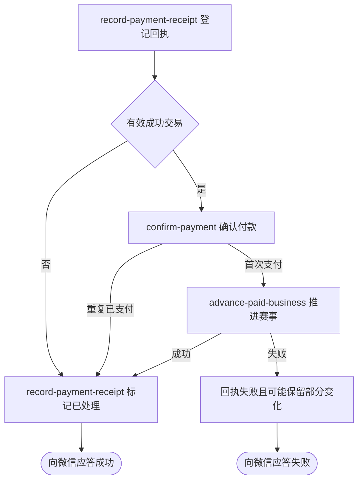

## 概要

接收微信支付回执，确认付款并推进关联赛事报名和正赛席位。

## 触发

微信支付在交易状态变化后向平台发送异步回执，平台需要确认首次付款并推进对应业务。

## 接口契约

请求体为微信支付原始通知，验签信息来自 `Wechatpay-Serial`、`Wechatpay-Nonce`、`Wechatpay-Signature`、`Wechatpay-Timestamp` 请求头。接受成功返回 HTTP 200 与 `{code: SUCCESS, message: 成功}`；处理失败返回 HTTP 500 与 `{code: FAIL, message: 处理失败}`，允许微信重试。

## 业务活动

- record-payment-receipt  登记并完成支付回执留痕
- confirm-payment  确认支付单付款结果
- advance-paid-business  推进关联赛事报名和席位

## 流程图

## 详细流程

1. 接收微信支付原始回执和验签请求头；交易事件通过微信 SDK 验签解密，未知事件按原文登记。
2. 为解析结果建立 `CALLBACK / RECEIVED` 支付日志，保存商户单号和解密后内容。
3. 仅当事件为交易、状态成功且商户单号非空时读取支付单；首次 `PENDING` 付款改为 `PAID`，记录渠道流水号和本地处理时间。
4. 对首次支付的赛事报名费，读取关联报名与赛事，原子占用一个正赛席位，将报名推进到 `MAIN / WAITING` 并进入赛事对应签位的正赛首轮。
5. 重新判断赛事轮次；资格赛比赛完成且席位已满时进入正赛首轮，并淘汰仍为 `QUALIFY / WAITING` 的报名。
6. 重复已支付回执不再次推进关联业务；未知事件、非成功交易或缺少商户单号的事件不改支付单。
7. 成功接受时把回执日志标为 `PROCESSED` 并返回微信 `SUCCESS`；处理异常时尽力标为 `FAILED` 并返回 HTTP 500 与 `FAIL`。

## 异常分支

| 对外失败码 | 触发条件 | 由哪个活动报出 | 补偿动作或超时处理 | 对外提示 |
|---|---|---|---|---|
| 回执验真失败 | 交易通知签名无效、无法解密或微信 SDK 配置不可用 | record-payment-receipt | 不建立留痕、不改业务；返回失败等待重试 | `FAIL / 处理失败` |
| 未知或无需推进事件 | 非交易事件、交易非成功或成功交易缺少商户单号 | record-payment-receipt | 标为 `PROCESSED`，支付单和赛事不变 | `SUCCESS / 成功` |
| `PAYMENT_ORDER_NOT_FOUND` | 商户单号没有对应支付单 | confirm-payment | 回执标 `FAILED`，不推进赛事 | `FAIL / 处理失败` |
| 重复成功回执 | 支付单已为 `PAID` | confirm-payment | 不再次推进报名或席位，回执标 `PROCESSED` | `SUCCESS / 成功` |
| `PAYMENT_STATUS_ILLEGAL` | 支付单为 `CLOSED` 或 `FAILED` | confirm-payment | 支付单保持原状，回执标 `FAILED` | `FAIL / 处理失败` |
| `TOURNAMENT_ENTRY_NOT_FOUND`／`TOURNAMENT_NOT_FOUND` | 赛事报名或赛事不存在 | advance-paid-business | 回执标 `FAILED`；此前支付单可能已为 `PAID` | `FAIL / 处理失败` |
| `TOURNAMENT_SLOTS_FULL` | 原子占位时正赛已满 | advance-paid-business | 不再占位，报名可能仍为 `PAYING`，支付单可能已为 `PAID` | `FAIL / 处理失败` |
| `TOURNAMENT_ENTRY_STATUS_ILLEGAL` | 关联报名不是 `PAYING` | advance-paid-business | 回执标 `FAILED`；此前付款或占位变化可能保留 | `FAIL / 处理失败` |
| 正赛轮次配置无效 | 总签位数不能映射到受支持的正赛首轮 | advance-paid-business | 回执标 `FAILED`；此前变化可能保留 | `FAIL / 处理失败` |
| `OPERATION_FAILED` | 回执、支付单、报名、席位或赛事轮次未完整保存 | 任一业务活动 | 尽力把回执标 `FAILED`；不保证已发生变化回滚 | `FAIL / 处理失败` |

## 技术线索

- HTTP：`POST /wechat/pay/notify`
- 入口：`WechatPayNotifyController.notify()` → `PaymentAppService.handlePayCallback()`
- 验签解密：`WechatPayClient.verifyAndParse()`，交易事件使用微信 `NotificationParser`
- 回执：`PaymentDomainService.handleCallback()`，支付日志 `CALLBACK / RECEIVED → PROCESSED|FAILED`
- 支付：`PaymentDomainService.markPaid()`；数据库只对 `PENDING` 条件更新，但当前忽略更新结果
- 业务分流：`PaymentPaidNotifier` → `TournamentEntryPaidHandler` → `TournamentPaymentService.advanceOnPaid()`
- 事务：`handleCallback()` 的 `@Transactional` 内部捕获业务异常，异常前变化可能提交
