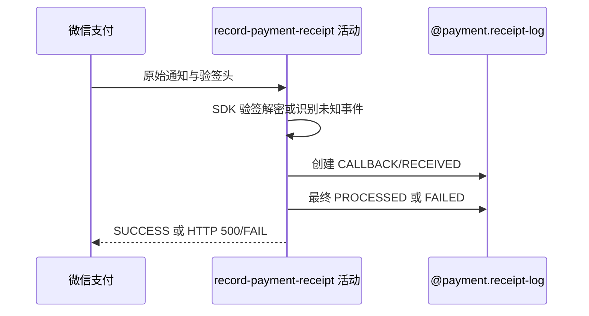

## 概要

验真解密微信通知，并登记回执从收到到最终结果的留痕。

## 时序图

## 触发条件

微信向公开回调入口发送支付事件时执行。

## 活动契约

交易事件必须由 SDK 验签解密；成功解析后创建 CALLBACK/RECEIVED 日志。未知/无需推进事件最终 PROCESSED，处理异常尽力 FAILED 并让微信重试。

## 异常分支

| 错误标识 | 触发条件 | 处理 |
|---|---|---|
| 回执验真失败 | 签名、解密或 SDK 配置无效 | 不留痕、不改业务，返回 500/FAIL |
| 无需推进 | 非交易、非成功或缺商户单号 | 标 PROCESSED，返回 SUCCESS |
| 业务异常 | 查单、确认或赛事推进失败 | 尽力标 FAILED，返回 500/FAIL |
| 失败留痕异常 | FAILED 更新也失败 | 状态可能停 RECEIVED，仍返回失败 |

## 领域依赖

### @payment.receipt-log
- 输入：渠道、事件、商户单号和解密内容
- 输出：RECEIVED 后的 PROCESSED/FAILED 留痕

## 业务动作

A1 验签解密回执
A2 建立收到留痕
A3 判定是否需要推进
A4 结束留痕并应答渠道

## 详细流程

1. 读取四个 Wechatpay 请求头与原始体；交易通知通过 SDK 验签解密，未知事件按可用原文识别。
2. 验真成功后以 logType=CALLBACK、processStatus=RECEIVED 保存日志，refId 为可得商户单号，rawBody 为解密内容。
3. 仅交易成功且商户单号非空进入后续确认；其他事件不改支付单。
4. 后续无异常标 PROCESSED 并响应 HTTP 200/SUCCESS；异常时尽力标 FAILED、写原因并响应 HTTP 500/FAIL。

## 边界情况

- 验真前失败不会留下 payment_log。
- 未知事件被接受后不会自动再次处理。
- 业务异常被内部捕获，异常前变化可能随外层方法提交。

## 实现提示

写入使用 `@payment.receipt-log`，`reads` 为空；微信 RPC snapshot 当前缺失。
