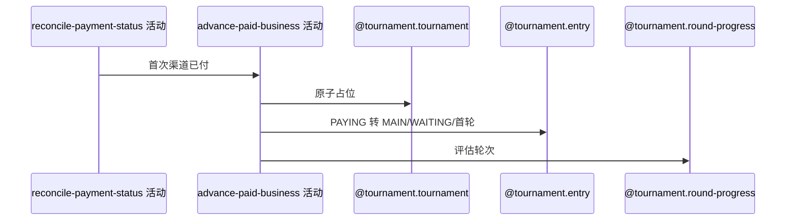

## 概要

为同步确认的报名费付款推进席位、报名和赛事轮次。

## 时序图

## 触发条件

用户同步首次把赛事报名费订单从 PENDING 确认为 PAID 时执行。

## 活动契约

关联报名须 PAYING，原子占用正赛席位并推进 MAIN/WAITING/首轮；满位且资格赛完成时进入正赛并淘汰剩余资格等待报名。

## 异常分支

| 错误标识 | 触发条件 | 处理 |
|---|---|---|
| 报名/赛事不存在或状态非法 | 关联对象不满足 | 本次本地事务整体回滚 |
| `TOURNAMENT_SLOTS_FULL` | 无可占席位 | 整体回滚，微信付款事实保留 |
| 轮次配置/`OPERATION_FAILED` | 首轮映射或保存失败 | 整体回滚，可再次同步 |

## 领域依赖

### @tournament.tournament
- 输入：锁位与总签位
- 输出：原子锁位+1
### @tournament.entry
- 输入：PAYING 报名
- 输出：MAIN/WAITING/首轮
### @tournament.round-progress
- 输入：资格赛完成与满位结果
- 输出：推进赛事并淘汰剩余资格报名

## 业务动作

A1 读取关联报名赛事
A2 原子占用席位
A3 推进报名正赛状态
A4 推进赛事轮次

## 详细流程

1. 仅 TOURNAMENT_ENTRY_FEE 首次付款进入；读取 refBizId 报名及赛事。
2. 条件原子增加 currentFilledSlots，满位失败。
3. 要求报名 PAYING，改 MAIN/WAITING、总签位对应正赛首轮并记 paidTime。
4. 资格赛完成且席位满时赛事进入首轮，剩余 QUALIFY/WAITING 报名 ELIMINATED。
5. 与支付单确认同事务，异常向外传播时全部本地变化回滚。

## 边界情况

- 回滚不改变微信已付款事实。
- 再次同步可重试整个本地推进。
- 本地已 PAID 时同步会短路，不会重试业务推进，这是现有补偿缺口。

## 实现提示

写活动 `reads` 为空；事务边界强于支付回调路径。
