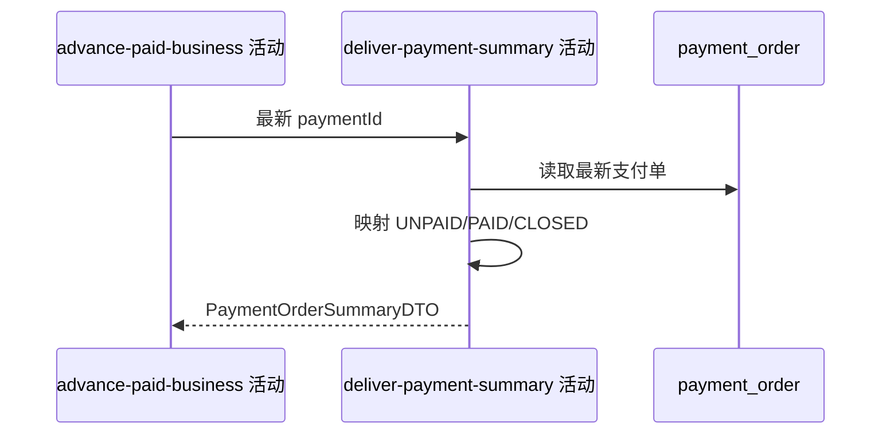

## 概要

交付同步后的支付单业务、金额与对外状态摘要。

## 时序图

## 触发条件

订单校验完成，且无需推进或业务推进成功后执行。

## 活动契约

返回支付单号、refBizId、付款人、本金、手续费、总额与对外状态，不交付内部 bizType；PENDING→UNPAID、PAID→PAID、CLOSED/FAILED→CLOSED。

## 异常分支

| 错误标识 | 触发条件 | 处理 |
|---|---|---|
| `OPERATION_FAILED` | 最新订单读取或枚举映射失败 | 整个同步请求失败 |

## 领域依赖

无

## 业务动作

A1 读取最新支付单
A2 映射金额与关联业务
A3 映射对外状态

## 详细流程

1. 使用已验证 paymentId 读取本地最新状态，不再次查询渠道。
2. 交付 bizId、refBizId、payerUserId、base/fee/payAmount；保持 main DTO，不增加 bizType。
3. PENDING 映射 UNPAID，PAID 映射 PAID，CLOSED 和 FAILED 都映射 CLOSED。
4. 本地已终态路径会直接执行本活动，未触发前置推进也能正常返回。

## 边界情况

- 对外不区分 CLOSED 与 FAILED。
- 摘要不含渠道流水、预支付编号或时间。
- 本地状态是唯一返回依据。

## 实现提示

纯查询活动，读取列按 DB snapshot 声明。
