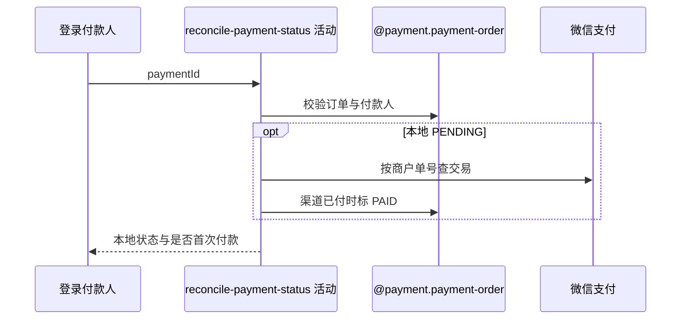

## 概要

校验付款人，按需查询微信并确认本地支付单。

## 时序图

## 触发条件

登录用户主动同步一笔本人支付单状态时执行。

## 活动契约

订单须存在且付款人为本人；PAID/CLOSED/FAILED 不查渠道。PENDING 时查询微信，未确认保持待付，确认成功则写 PAID 并触发首次业务推进。

## 异常分支

| 错误标识 | 触发条件 | 处理 |
|---|---|---|
| `PAYMENT_ORDER_NOT_FOUND`/`PAYMENT_NOT_PAYER` | 单不存在或非本人 | 不变更 |
| 渠道未付 | 微信非成功或可转换查单业务错误 | 保持 PENDING，按 UNPAID 返回 |
| `PAYMENT_CHANNEL_NOT_SUPPORTED` | 渠道/SDK 不可用 | 本地不变 |
| `OPERATION_FAILED` | 支付单保存失败 | 本地事务回滚，可重试 |

## 领域依赖

### @payment.payment-order
- 输入：paymentId、当前 userId 和渠道结果
- 输出：当前状态或首次 PAID

## 业务动作

A1 校验订单与付款人
A2 短路终态订单
A3 查询待付渠道结果
A4 确认首次支付

## 详细流程

1. 按 paymentId 取得订单并要求 payerUserId=当前用户。
2. 本地 PAID、CLOSED、FAILED 直接短路，不查询微信、不重复推进。
3. PENDING 按商户单号查微信；非成功或被转换为未付的 ServiceException 保持 PENDING。
4. 渠道确认已付时写 PAID、渠道流水和本地 payTime；与后续业务推进处于同一应用事务，异常外抛会回滚本次本地变化。

## 边界情况

- CLOSED/FAILED 即使渠道后来已付也不会由用户同步发现。
- 微信付款事实不受本地事务回滚影响，可再次同步。
- 当前条件更新影响行数仍未被显式检查。

## 实现提示

写入使用 `@payment.payment-order`，`reads` 为空；微信 RPC snapshot 缺失。
