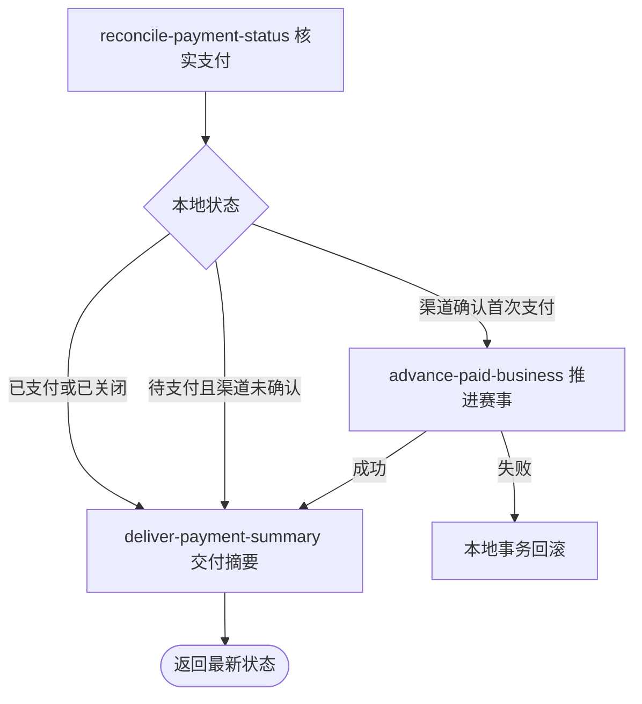

## 概要

让付款人主动查询微信支付结果，必要时补齐支付单和关联赛事报名推进。

## 触发

付款人在支付完成页等待异步结果，主动要求核实一笔属于自己的支付单。

## 接口契约

查询参数 `paymentId` 指定支付单。成功返回支付单号、关联业务编号、付款人、各项金额和对外状态，不交付内部 `bizType`；对外状态为 `UNPAID`、`PAID` 或 `CLOSED`。

## 业务活动

- reconcile-payment-status  核实渠道结果并确认支付单
- advance-paid-business  推进关联赛事报名和席位
- deliver-payment-summary  交付最新支付摘要

## 流程图

## 详细流程

1. 识别当前登录用户，接收支付单号，读取支付单并确认当前用户是付款人。
2. 支付单已为 `PAID`、`CLOSED` 或 `FAILED` 时不查渠道，直接映射并返回当前对外状态。
3. 支付单为 `PENDING` 时按商户单号查询微信支付；未确认成功或查单返回失败结果时保持待支付。
4. 微信确认已付时将支付单改为 `PAID`，记录渠道流水号和本地确认时间。
5. 对首次支付的赛事报名费，原子占用正赛席位，将关联 `PAYING` 报名推进到 `MAIN / WAITING` 和对应正赛首轮。
6. 根据资格赛完成数和已占席位推进赛事轮次；席位满时淘汰仍为 `QUALIFY / WAITING` 的报名。
7. 在同一事务中提交本地推进，返回支付单号、关联业务、金额与最新对外状态摘要。

## 异常分支

| 对外失败码 | 触发条件 | 由哪个活动报出 | 补偿动作或超时处理 | 对外提示 |
|---|---|---|---|---|
| 未登录/参数错误 | 无有效登录或缺少 `paymentId` | 入口鉴权与绑定 | 不读取/修改 | 统一登录／参数提示 |
| `PAYMENT_ORDER_NOT_FOUND` | 支付单不存在 | reconcile-payment-status | 无变更 | 支付单不存在 |
| `PAYMENT_NOT_PAYER` | 当前用户不是支付单付款人 | reconcile-payment-status | 无变更 | 无权操作该支付单 |
| 本地已支付 | 支付单为 `PAID` | deliver-payment-summary | 不查微信、不重复推进，返回 `PAID` | 查询成功 |
| 本地已关闭 | 支付单为 `CLOSED` 或 `FAILED` | deliver-payment-summary | 不查微信，统一返回 `CLOSED` | 查询成功 |
| 渠道未确认付款 | 微信返回非成功，或查单 `ServiceException` 被转换为未支付 | reconcile-payment-status | 支付单保持 `PENDING`，返回 `UNPAID` | 查询成功 |
| `PAYMENT_CHANNEL_NOT_SUPPORTED` | 支付渠道不可路由或微信 SDK 配置不可用 | reconcile-payment-status | 本地无变更 | 暂不支持该支付渠道 |
| `TOURNAMENT_ENTRY_NOT_FOUND`／`TOURNAMENT_NOT_FOUND` | 已付款单的关联报名或赛事不存在 | advance-paid-business | 本次本地变化整体回滚，微信付款事实保留 | 对应报名／赛事不存在提示 |
| `TOURNAMENT_ENTRY_STATUS_ILLEGAL` | 关联报名不是 `PAYING` | advance-paid-business | 本次本地变化整体回滚 | 报名当前状态不允许该操作 |
| `TOURNAMENT_SLOTS_FULL` | 正赛已无可占席位 | advance-paid-business | 本次本地变化整体回滚 | 正赛席位已满，暂无法支付 |
| `OPERATION_FAILED` | 支付单、席位、报名或赛事状态未完整保存 | reconcile-payment-status／advance-paid-business | 本次本地事务回滚，可再次同步 | 系统异常，请稍后重试 |

## 技术线索

- HTTP：`POST /payment/sync-status?paymentId=...`
- 入口：`PaymentController.syncStatus()` → `PaymentAppService.syncPayStatus()`
- 查单：`PaymentDomainService.recoverIfPaid()` → `WechatPayClient.queryTrade()`
- 支付：`PaymentDomainService.markPaid()`；数据库只对 `PENDING` 条件更新，但当前忽略更新结果
- 业务分流：`PaymentPaidNotifier` → `TournamentEntryPaidHandler` → `TournamentPaymentService.advanceOnPaid()`
- 事务：应用服务 `@Transactional`，异常向外传播时回滚本次全部本地变化
