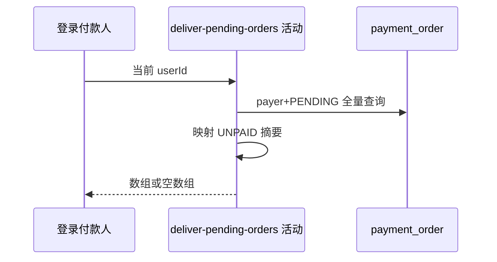

## 概要

查询并交付本人全部本地待支付单摘要。

## 时序图

## 触发条件

登录用户打开本人待付款清单时执行。

## 活动契约

只按 payerUserId 和内部 PENDING 筛选，不查渠道、不判断 expireTime；不分页、不限量、无明确排序，空结果返回 `[]`。

## 异常分支

| 错误标识 | 触发条件 | 处理 |
|---|---|---|
| 无待支付单 | 本人无 PENDING | 返回空数组 |
| `OPERATION_FAILED` | 读取或枚举转换失败 | 查询失败，无数据变更 |

## 领域依赖

无

## 业务动作

A1 按付款人筛 PENDING
A2 映射业务与金额
A3 映射 UNPAID 并返回

## 详细流程

1. 以登录 userId 为 payerUserId，查询内部 status=PENDING 的全部订单。
2. 不检查 expireTime，即使已过期但超时任务尚未关闭仍会展示；不调用微信核实。
3. 映射 paymentId、业务类型/ref、付款人、本金、手续费、总额，状态统一 UNPAID。
4. 无分页、limit 或排序；无结果返回空数组而非 null。

## 边界情况

- 已过期 PENDING 仍可暂时出现在列表。
- 渠道已付但本地未确认的订单仍显示 UNPAID。
- 数据量随个人历史未关闭订单线性增长。

## 实现提示

纯查询活动，读取列按 DB snapshot 精确声明。
