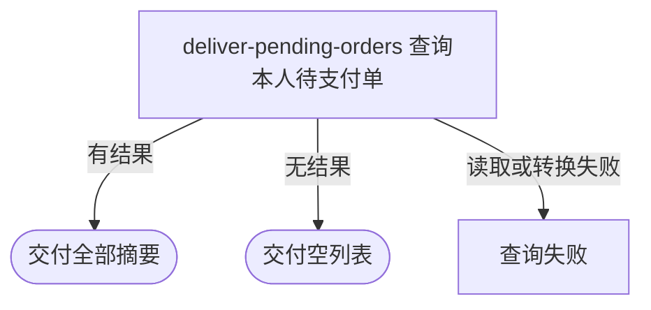

## 概要

向登录付款人交付本人全部本地状态仍为待支付的支付单摘要。

## 触发

登录用户进入待付款页面，需要查看自己仍可见为待支付的本地支付单。

## 接口契约

请求无业务参数。成功返回 `PaymentOrderSummaryDTO` 数组；无结果返回空数组，不返回 `null`。

## 业务活动

- deliver-pending-orders  查询并交付本人待支付单

## 流程图

## 详细流程

1. 识别当前登录用户，以其作为支付单付款人筛选条件。
2. 查询付款人为本人且内部状态严格为 `PENDING` 的全部支付单，不判断过期时间，也不查询支付渠道。
3. 将每张支付单映射为编号、关联业务编号、付款人、本金、手续费、应付总额和对外 `UNPAID` 状态摘要。
4. 不分页、不限量且不施加明确排序地返回全部结果；没有符合项时返回空列表。

## 异常分支

| 对外失败码 | 触发条件 | 由哪个活动报出 | 补偿动作或超时处理 | 对外提示 |
|---|---|---|---|---|
| `TOKEN_EXPIRED` | 未携带约定格式的登录凭证 | 入口鉴权 | 只读，无变更 | 登录已过期，请重新登录 |
| `TOKEN_INVALID` | 登录凭证无法识别 | 入口鉴权 | 只读，无变更 | 登录凭证无效，请重新登录 |
| 无待支付单 | 本人没有内部状态为 `PENDING` 的记录 | deliver-pending-orders | 返回空数组 | 查询成功 |
| `OPERATION_FAILED` | 支付单枚举值无法转换或资料读取失败 | deliver-pending-orders | 只读，无变更 | 系统异常，请稍后重试 |

## 技术线索

- HTTP：`GET /payment/my-pending`
- 调用：`PaymentController.myPending()` → `PaymentQueryAppService.myPending()` → `PaymentQueryDomainService.myPending()`
- 查询：`PaymentOrderRepository.listPendingByPayer()`，条件为付款人和 `PENDING`
- 映射：`PaymentAppConvertMapper.toSummaryList()`，内部状态通过 `PaymentOrder.toViewStatus()` 转为 `UNPAID`
