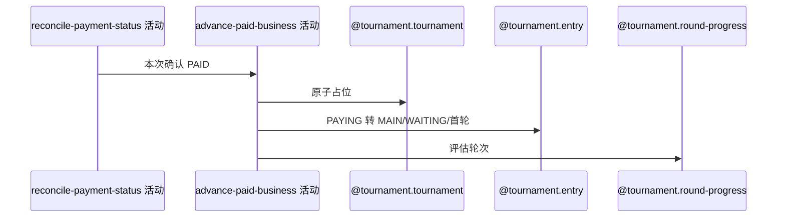

## 概要

为恢复确认的报名费付款推进正赛席位、报名与轮次。

## 时序图

## 触发条件

恢复任务本次确认赛事报名费订单已付款时执行。

## 活动契约

原子占位、将 PAYING 报名转 MAIN/WAITING/首轮，并在资格赛完成且满位时推进赛事和淘汰剩余资格等待报名。

## 异常分支

| 错误标识 | 触发条件 | 处理 |
|---|---|---|
| 报名/赛事缺失、状态非法或满位 | 关联业务不满足 | 本条失败；PAID/席位等前序变化可能保留 |
| 轮次配置/`OPERATION_FAILED` | 首轮映射或保存失败 | 本条失败，外层继续其他回执 |

## 领域依赖

### @tournament.tournament
- 输入：锁位/总签位
- 输出：原子占位
### @tournament.entry
- 输入：PAYING 报名
- 输出：MAIN/WAITING/首轮
### @tournament.round-progress
- 输入：资格赛完成及满位
- 输出：赛事首轮和剩余资格报名淘汰

## 业务动作

A1 读取报名赛事
A2 原子占位
A3 推进报名
A4 评估轮次

## 详细流程

1. 仅本次从 PENDING 确认的报名费订单进入，读取关联报名与赛事。
2. 条件增加锁位，要求报名 PAYING，改 MAIN/WAITING/总签位对应首轮并记 paidTime。
3. 资格赛完成且锁位满时推进赛事首轮，剩余 QUALIFY/WAITING 报名 ELIMINATED。
4. 单条恢复无统一事务，异常前订单 PAID、锁位等可能保留；外层记录后继续。

## 边界情况

- 已 PAID 订单在前置活动会短路，不会进入本活动。
- 部分推进失败后回执会标 FAILED，不再由 RECEIVED 扫描。
- 支付事实不可回滚。

## 实现提示

写活动 `reads` 为空；保留恢复任务的弱事务边界。
