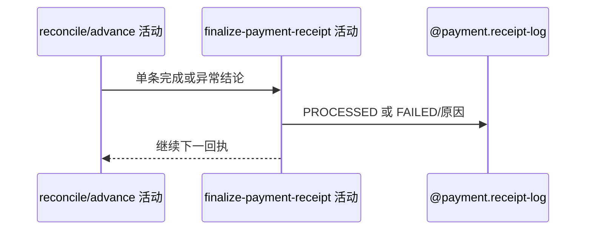

## 概要

按单条恢复结果把滞留回执结束为已处理或失败。

## 时序图

## 触发条件

每条滞留回执完成短路、查单或业务推进后执行。

## 活动契约

无异常及无需处理/未付/终态订单均标 PROCESSED；订单缺失或渠道/业务异常标 FAILED。失败状态自身保存异常会中断当前扫描。

## 异常分支

| 错误标识 | 触发条件 | 处理 |
|---|---|---|
| 正常结束 | 无效关联、终态订单、渠道未付或推进成功 | 标 PROCESSED |
| 恢复失败 | 订单缺失、渠道或业务异常 | 标 FAILED 并写原因，继续下一条 |
| 失败留痕更新异常 | FAILED 保存失败 | 当前扫描中断，后续记录留待下次 |

## 领域依赖

### @payment.receipt-log
- 输入：单条恢复结果和失败原因
- 输出：PROCESSED 或 FAILED 终态

## 业务动作

A1 归类恢复结果
A2 标记回执终态
A3 控制是否继续扫描

## 详细流程

1. ref 无效、订单已结束、渠道未付或业务推进成功均把 RECEIVED 改 PROCESSED。
2. 订单不存在写 FAILED/`payment_order_not_found`；其他异常写 FAILED 与可用原因。
3. 外层逐条捕获恢复异常，通常标失败后继续。
4. 若失败留痕更新本身抛错未被内层吸收，扫描中断，剩余 RECEIVED 下轮处理。

## 边界情况

- PROCESSED 后即使渠道稍后支付也不再自动重查该回执。
- FAILED 也不属于下一轮 RECEIVED 扫描。
- 日志终态不保证关联业务一定完整。

## 实现提示

写入使用 `@payment.receipt-log`，`reads` 为空。
