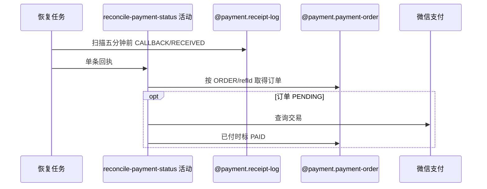

## 概要

逐条复核滞留回执关联订单，并按需查询渠道确认付款。

## 时序图

## 触发条件

恢复任务扫描到创建已超过五分钟的 CALLBACK/RECEIVED 回执时逐条执行。

## 活动契约

无有效 ORDER 关联无需查单；订单非 PENDING 不查渠道；PENDING 查询微信，未付保持，确认已付则标 PAID 并输出首次推进信号。

## 异常分支

| 错误标识 | 触发条件 | 处理 |
|---|---|---|
| 无效关联 | refType 非 ORDER 或 refId 空 | 无需查订单，交后续 PROCESSED |
| 支付单不存在 | refId 无订单 | 交后续 FAILED |
| 订单已结束 | PAID/CLOSED/FAILED | 不查渠道、不推进，交后续 PROCESSED |
| 渠道未付 | 非成功或可转换 ServiceException | 保持 PENDING，交后续 PROCESSED |
| 渠道/保存异常 | 配置、查单或确认失败 | 交后续 FAILED；异常前变化可能保留 |

## 领域依赖

### @payment.receipt-log
- 输入：五分钟前 CALLBACK/RECEIVED 条件
- 输出：待恢复回执集合
### @payment.payment-order
- 输入：refId 与渠道查询结果
- 输出：原状态或 PAID

## 业务动作

A1 扫描并解析订单关联
A2 短路无效或终态订单
A3 查询 PENDING 渠道结果
A4 按需确认支付

## 详细流程

1. 外层全量查询 logType=CALLBACK、processStatus=RECEIVED、createTime<当前减 5 分钟，无分页和排序。
2. refType 非 ORDER 或 refId 空时无需订单；订单不存在输出失败结论。
3. 订单非 PENDING 直接结束，不补做其关联业务推进。
4. PENDING 查询微信；未确认已付保持原单，确认成功写 PAID、渠道流水和本地时间。
5. 扫描、单条与支付恢复无统一事务，异常前本地变化可能保留。

## 边界情况

- 渠道未付的回执会被最终 PROCESSED，之后不再自动重查。
- 本地已 PAID 但业务未推进时也直接 PROCESSED，存在补偿缺口。
- 待恢复数量无上限，单轮可能很大。

## 实现提示

写活动 `reads` 为空；扫描与订单变更通过两个支付聚合表达。
