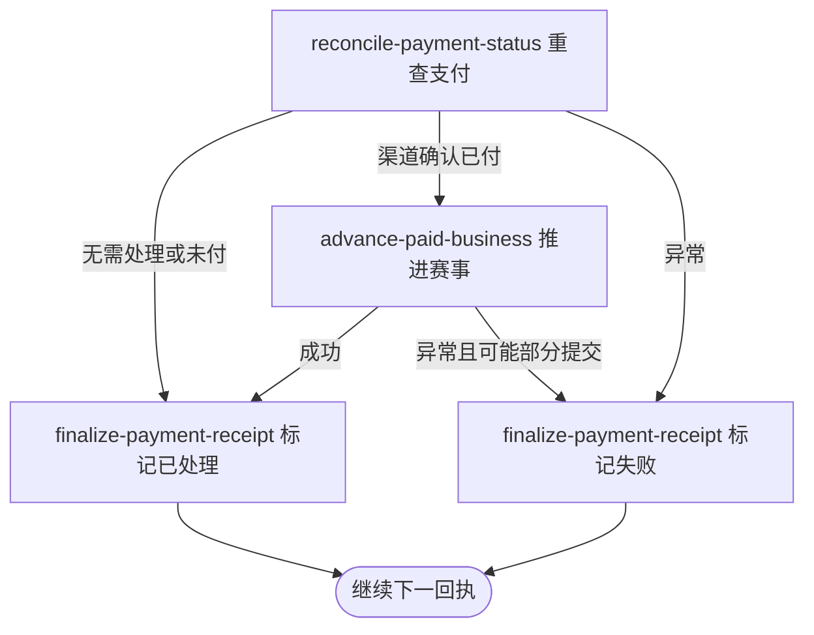

## 概要

定时重查长期停留在已收到状态的支付回执，补齐已付款业务推进并结束留痕。

## 触发

任务仅在 `job.payment_callback_recover.enabled=true` 时注册，按 `job.payment_callback_recover.cron` 运行，缺省表达式为 `0 */10 * * * ?`。调度未指定时区，按应用运行时默认时区解释。

## 接口契约

定时入口无请求参数和对外交付。一次处理扫描时全部已超过五分钟的 `CALLBACK / RECEIVED` 回执；没有符合记录时静默结束。

## 业务活动

- reconcile-payment-status  重查渠道并确认支付单
- advance-paid-business  推进关联赛事报名和席位
- finalize-payment-receipt  结束回执处理留痕

## 流程图

## 详细流程

1. 任务在配置开关启用时按 cron 运行，缺省每十分钟触发一次。
2. 查询全部 `logType=CALLBACK`、`processStatus=RECEIVED` 且创建已超过五分钟的回执日志，不分页、不限量且无明确排序。
3. 回执关联类型不是 `ORDER` 或关联编号空白时，不查支付单，直接标为 `PROCESSED`。
4. 关联支付单不存在时把回执标为 `FAILED`；支付单不是 `PENDING` 时不查渠道，直接结束回执。
5. 对 `PENDING` 支付单查询微信；未确认已付时保持原单并把回执标为 `PROCESSED`。
6. 微信确认已付时将支付单改为 `PAID`，并复用支付成功分流推进关联赛事报名、正赛席位和赛事轮次。
7. 单条无异常时把回执标为 `PROCESSED`；异常时标为 `FAILED` 并继续其余回执，扫描结束后任务完成。

## 异常分支

| 对外失败码 | 触发条件 | 由哪个活动报出 | 补偿动作或超时处理 | 对外提示 |
|---|---|---|---|---|
| 任务未注册 | `job.payment_callback_recover.enabled` 未设为 `true` | 调度装配 | 不扫描 | 无对外提示 |
| 无待补偿回执 | 没有超过五分钟的 `CALLBACK / RECEIVED` 日志 | reconcile-payment-status | 静默结束 | 无对外提示 |
| 无有效订单关联 | `refType` 不是 `ORDER` 或 `refId` 空白 | finalize-payment-receipt | 不查订单，回执标 `PROCESSED` | 无对外提示 |
| 支付单不存在 | 关联编号找不到支付单 | finalize-payment-receipt | 回执标 `FAILED`，原因 `payment_order_not_found` | 无对外提示 |
| 支付单已结束 | 支付单为 `PAID`、`CLOSED` 或 `FAILED` | finalize-payment-receipt | 不查微信、不推进业务，回执标 `PROCESSED` | 无对外提示 |
| 渠道未确认付款 | 微信返回非成功，或查单 `ServiceException` 被转换为未支付 | finalize-payment-receipt | 支付单保持 `PENDING`，回执标 `PROCESSED` 且不再自动重查 | 无对外提示 |
| 渠道或业务推进异常 | 微信配置不可用，或报名、赛事、席位和状态推进失败 | reconcile-payment-status／advance-paid-business | 尝试把回执标 `FAILED`；异常前本地变化可能保留 | 无对外提示 |
| 失败留痕更新异常 | 单条异常后回执无法标为 `FAILED` | finalize-payment-receipt | 当前扫描中断，后续记录留待下次 | 无对外提示 |

## 技术线索

- 调度：`PaymentCallbackRecoverJob.scan()`
- 开关：`job.payment_callback_recover.enabled=true`
- cron：`${job.payment_callback_recover.cron:0 */10 * * * ?}`
- 阈值：`RECEIVED_TIMEOUT_MINUTES=5`
- 查询：`PaymentLogRepository.listUnprocessedCallback(before)`
- 查单与支付：`PaymentDomainService.recoverIfPaid()` → `markPaid()`
- 业务分流：`PaymentPaidNotifier` → `TournamentEntryPaidHandler` → `TournamentPaymentService.advanceOnPaid()`
- 事务：扫描、单条恢复及支付恢复均无统一事务；循环逐条捕获业务异常
