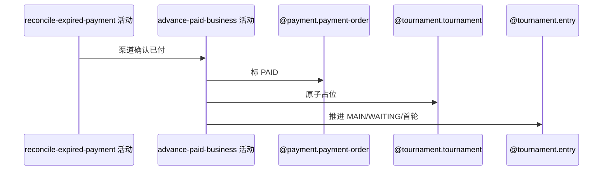

## 概要

确认到期单真实已付，并推进关联赛事报名和席位。

## 时序图

## 触发条件

到期订单渠道查询确认已付款时执行。

## 活动契约

先把 PENDING 订单标 PAID，再为报名费订单占位并推进报名/赛事轮次；各步无统一事务，异常前变化可能保留且订单不再被到期扫描。

## 异常分支

| 错误标识 | 触发条件 | 处理 |
|---|---|---|
| 并发状态变化 | 条件标 PAID 无效但结果未检查 | 仍可能继续业务推进 |
| 关联对象/状态/席位错误 | 报名赛事缺失、非 PAYING 或满位 | 记录异常；PAID 等先前变化可能保留 |
| 轮次配置/保存失败 | 映射或持久化异常 | 单笔结束，继续其他订单 |

## 领域依赖

### @payment.payment-order
- 输入：渠道成功订单
- 输出：PAID、流水和时间
### @tournament.tournament
- 输入：锁位和总签位
- 输出：原子占位与按需轮次推进
### @tournament.entry
- 输入：PAYING 报名
- 输出：MAIN/WAITING/首轮及剩余资格淘汰
### @tournament.round-progress
- 输入：资格赛完成和满位结果
- 输出：赛事首轮

## 业务动作

A1 确认支付单 PAID
A2 读取关联报名赛事
A3 原子占位并推进报名
A4 评估赛事轮次

## 详细流程

1. 记录 PAID、渠道流水及本地 payTime；条件仅 PENDING，但当前忽略影响行数。
2. 报名费订单读取关联报名赛事，原子增加锁位，要求报名 PAYING。
3. 报名改 MAIN/WAITING/总签位首轮并记 paidTime；满位且资格赛完成时推进赛事并淘汰剩余 QUALIFY/WAITING。
4. 任务无单笔统一事务；失败记录后继续，订单若已 PAID 将不再进入到期扫描。

## 边界情况

- 支付确认成功但业务推进失败可能形成永久部分状态。
- 并发条件更新结果未检查可能造成重复推进风险。
- 不发送用户通知。

## 实现提示

写活动 `reads` 为空；这是支付任务中最弱的一致性边界之一。
