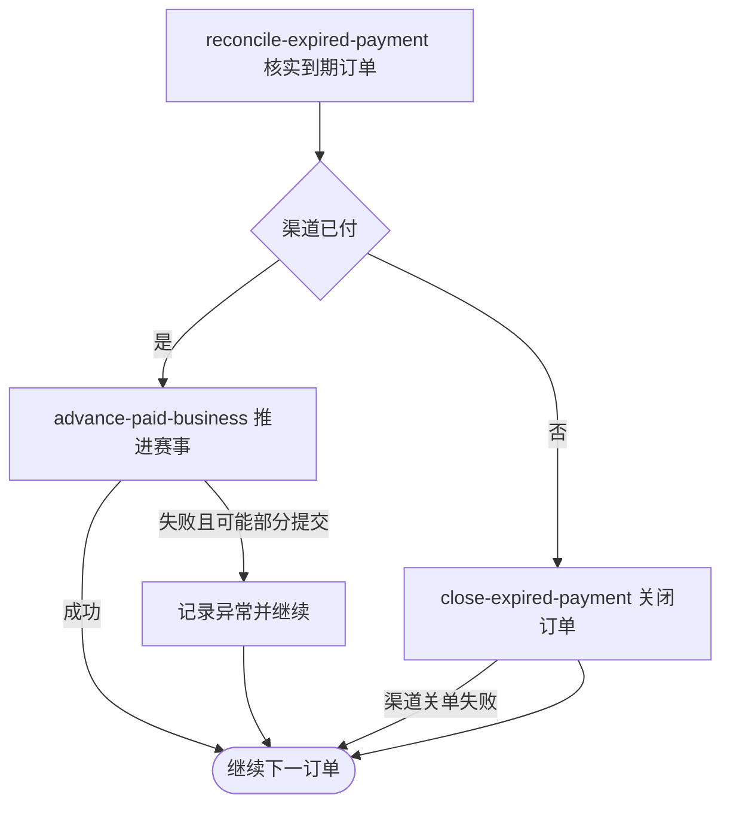

## 概要

定时核实已过期的待支付单，补记真实付款或关闭未确认付款的本地与微信订单。

## 触发

任务仅在 `job.payment_timeout.enabled=true` 时注册，按 `job.payment_timeout.cron` 运行，缺省表达式为 `0 */5 * * * ?`。调度未指定时区，按应用运行时默认时区解释。

## 接口契约

定时入口无请求参数和对外交付。一次处理扫描时全部到期且仍为 `PENDING` 的支付单；没有符合记录时静默结束。

## 业务活动

- reconcile-expired-payment  核实到期支付结果
- advance-paid-business  推进关联赛事报名和席位
- close-expired-payment  关闭未确认付款的本地与渠道订单

## 流程图

## 详细流程

1. 任务在配置开关启用时按 cron 运行，缺省每五分钟触发一次。
2. 查询全部 `status=PENDING`、`expireTime` 非空且早于扫描时刻的支付单，不分页、不限量且无明确排序。
3. 逐笔向支付单所属渠道查询交易状态。
4. 微信确认已付时，将支付单改为 `PAID`，并复用支付成功分流推进关联赛事报名、正赛席位和赛事轮次。
5. 微信未确认已付或查单业务错误时，将本地支付单改为 `CLOSED` 并清空活跃关联，再尽力请求微信关闭商户订单；关联报名保持 `PAYING`。
6. 渠道关单失败不恢复本地 `CLOSED`；单笔其他异常只记录日志并继续下一笔。
7. 处理完本次全部到期支付单后任务结束，不向用户发送通知。

## 异常分支

| 对外失败码 | 触发条件 | 由哪个活动报出 | 补偿动作或超时处理 | 对外提示 |
|---|---|---|---|---|
| 任务未注册 | `job.payment_timeout.enabled` 未设为 `true` | 调度装配 | 不扫描 | 无对外提示 |
| 无到期支付单 | 没有 `PENDING` 且期限严格早于当前时刻的记录 | reconcile-expired-payment | 静默结束 | 无对外提示 |
| 渠道暂不可用 | 支付渠道不支持、微信 SDK 未就绪或查单抛出未转换异常 | reconcile-expired-payment | 记录本笔异常；通常保持 `PENDING`，后续扫描重试 | 无对外提示 |
| 渠道未确认付款 | 微信返回非成功状态，或查单 `ServiceException` 被转换为未支付 | close-expired-payment | 本地改 `CLOSED` 并尝试渠道关单；报名保持 `PAYING` | 无对外提示 |
| 并发状态变化 | 本地支付单在扫描后已不再是 `PENDING` | close-expired-payment／advance-paid-business | 条件更新可能无效但结果未检查，仍可能推进赛事或请求关单 | 无对外提示 |
| 关联业务推进异常 | 报名、赛事不存在，报名状态不符、正赛满位或轮次配置无效 | advance-paid-business | 记录本笔异常；已写 `PAID`、席位等变化可能保留且不再扫描 | 无对外提示 |
| 渠道关单失败 | 微信关闭商户订单失败 | close-expired-payment | 忽略并记录警告；本地保持 `CLOSED`，不再扫描 | 无对外提示 |
| 单笔资料保存失败 | 支付单、报名、席位或赛事状态未完整保存 | 任一业务活动 | 记录异常并继续其他订单；无统一回滚或补齐 | 无对外提示 |

## 技术线索

- 调度：`PaymentTimeoutJob.scan()`
- 开关：`job.payment_timeout.enabled=true`
- cron：`${job.payment_timeout.cron:0 */5 * * * ?}`
- 查询：`PaymentOrderRepository.listExpiredPending(now)`，严格 `expireTime < now`
- 核实：`PaymentDomainService.timeoutCheck()` → `WechatPayClient.queryTrade()`
- 已付：`PaymentDomainService.markPaid()` → `PaymentPaidNotifier` → `TournamentPaymentService.advanceOnPaid()`
- 关单：`PaymentOrderRepository.close()` 后 `PaymentChannelClient.closeTrade()`，两者结果不构成原子操作
- 事务：任务和单笔处理无统一事务；循环逐单捕获异常
