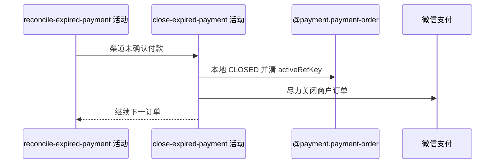

## 概要

关闭渠道未确认付款的本地到期单并尽力关闭微信订单。

## 时序图

## 触发条件

到期订单渠道返回未成功或可转换为未付款结果时执行。

## 活动契约

先把本地订单从 PENDING 改 CLOSED 并清活跃关联，再请求渠道关单；渠道关单失败不恢复本地状态，关联赛事报名保持 PAYING。

## 异常分支

| 错误标识 | 触发条件 | 处理 |
|---|---|---|
| 并发状态变化 | 扫描后已非 PENDING | 条件关闭可能无效但结果未检查，仍可能请求关单 |
| 渠道关单失败 | 微信关闭失败 | 记录警告，本地保持 CLOSED |
| 本地保存失败 | CLOSED/activeRefKey 未完整保存 | 记录单笔异常，继续其他订单 |

## 领域依赖

### @payment.payment-order
- 输入：到期 PENDING 订单
- 输出：CLOSED 且 activeRefKey 清空

## 业务动作

A1 条件关闭本地订单
A2 释放活跃业务唯一键
A3 尽力关闭渠道订单

## 详细流程

1. 按订单 bizId 执行仅 PENDING 可关闭的更新，写 status=CLOSED、activeRefKey=null。
2. 当前不检查更新影响行数；并发已 PAID/CLOSED 时仍可能继续调用渠道关单。
3. 本地关闭后调用对应渠道 closeTrade；异常仅警告，不恢复 CLOSED。
4. 不修改关联报名，仍保持 PAYING；关闭释放活跃键后可由用户重新创建支付单。

## 边界情况

- 本地与微信关单不是原子操作。
- 本地 CLOSED 后不再进入超时扫描。
- 报名不会自动退回 WAITING 或取消。

## 实现提示

写入使用 `@payment.payment-order`，`reads` 为空；明确保留未检查条件更新结果的竞态。
