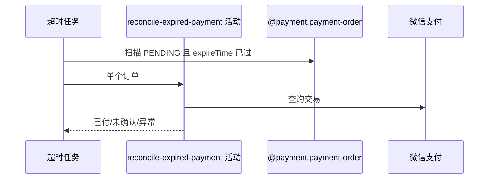

## 概要

逐笔查询到期待付单渠道结果，区分真实付款与待关闭。

## 时序图

## 触发条件

任务扫描到 status=PENDING、expireTime 非空且严格早于当前时刻的订单时逐笔执行。

## 活动契约

按订单渠道查询交易；确认已付进入支付与业务推进，非成功或可转换查单错误进入关闭，未转换渠道异常保留 PENDING 待后续扫描。

## 异常分支

| 错误标识 | 触发条件 | 处理 |
|---|---|---|
| 渠道未确认 | 返回非成功或 ServiceException 转未付 | 输出待关闭 |
| 渠道暂不可用 | 不支持、SDK 未就绪或未转换异常 | 记录单笔异常，通常保持 PENDING |
| 无到期订单 | 扫描为空 | 静默结束 |

## 领域依赖

### @payment.payment-order
- 输入：PENDING/expireTime 扫描条件和渠道身份
- 输出：到期订单与渠道核实结论

## 业务动作

A1 扫描严格到期 PENDING
A2 路由订单支付渠道
A3 查询交易状态
A4 分流已付、未付或异常

## 详细流程

1. 外层查询 status=PENDING、expireTime 非空且 expireTime<now 的全部订单，无分页和明确排序。
2. 每笔按 channel 调用查询接口；微信成功状态输出“已付”。
3. 微信非成功或特定 ServiceException 被视为“未确认付款”，交关闭活动。
4. 渠道不支持、SDK 配置或其他异常由外层逐单记录，订单通常保持 PENDING 等下一轮。

## 边界情况

- expireTime 恰等于扫描时刻不命中，须严格早于。
- 单轮数量无上限。
- 扫描后并发状态变化在后续条件更新中未可靠检查。

## 实现提示

写活动 `reads` 为空；渠道 RPC snapshot 缺失。
